# Measuring the Potential Impact of Proposed BRT in Halifax, NS
## Route to Change
  
Visit the app [here.](https://www.arcgis.com/home/item.html?id=d15ffa9ee8b840df879277635594d149)

## Meet the Team: Emissions Impossible
+ Emily Klaassen
+ Savanna Yan
+ Leo Chaulk  
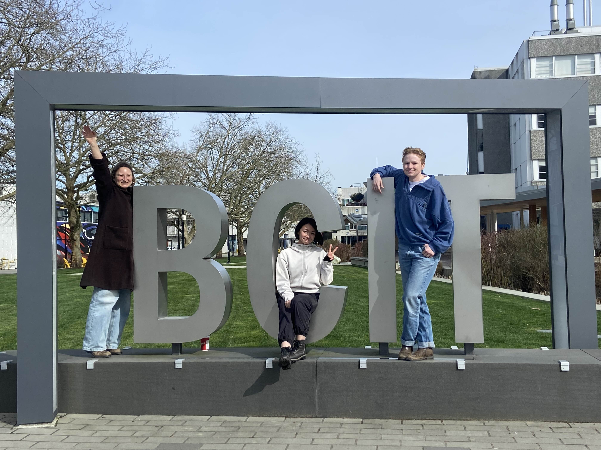  

# Mission Statement

Car dependent cities represent a major barrier to sustainability and equity in North American cities[^1], with transportation representing a significant share of a city's total carbon footprint. Investing in public transportation has been identified by the United Nations as a key strategy to reach sustainable development goals[^2]. Culturally, transit allows more efficient and equitable access to goods and services for people of varying mobility and income levels[^3] and can support community development while providing environmental benefits of lower greenhouse gas emissions[^4]. As a result, increasing the sustainability of transportation requires an approach that is multidisciplinary and considers social, economic, and environmental factors, with potential to have positive impacts across these sectors.

A Bus Rapid Transit system (BRT) is one strategy to provide faster and more reliable service for a more economical cost than other rapid transit options, particularly with dedicated bus lanes or signal priorities included[^5]. The City of Halifax has included this alongside other structural changes to increase the sustainability of their system; their 4-year Strategic Roadmap for Transit[^6] includes extensive planning for accessibility and safety as well as striving for net-zero emissions, addressing the key factors that contribute to keeping their city moving on the 'Route to Change.'

Public adoption is a highly user-dependent element of effective transit planning that involves modelling possible outcomes of different user acceptance levels. Emissions Impossible aims to provide an interactive desktop application to model predicted changes in ridership and emissions associated with the implementation of the proposed bus routes, using different assumptions for "willingness to travel" durations for vehicle-based commuters. This provides a realistic way to model the projected impacts of proposed development to keep the city on track to meet its sustainable development goals.

City officials can also utilize this tool to enhance public awareness about the proposed transit system and encourage acceptance. The current state of public transit in Halifax has drawn criticism for its congestion and unreliability[^7], and public involvement and engagement can help to improve this moving forward. 

Finally, the app allows planners to model how overall and census-level emissions may change by reconfiguring the fleet to rely on cleaner energy sources, extending the app's capabilities beyond visualizing proposed scenarios towards true simulation functionality. As the City is still in the active planning phase of their transportation changes, this application can maximize impacts and help target the communities that stand to benefit the most from emissions-friendly transportation and provide insights into possible barriers of adoption as the project progresses into implementation.

# Statement of Characteristics

The first page of Route to Change helps Planners addresses the "current situation", allowing users to visualize the current emissions levels of car-based commuters in the City of Halifax. A user can select a census tract and the display will highlight the daily commute routes taken by residents of that tract to all destination tracts. Table views on the right allows the user to view the number of daily commutes traversing each route along with the total daily driving-related CO2 emissions and number of daily commuters departing from each census tract.  

The second page addresses the "proposed situation": through a combination of maps and interactive figures, users can toggle through "willingness to travel" thresholds of 30, 45 and 60 minutes to view the differences in projected ridership and associated emissions. The user can zoom in to certain areas of the map and the figures will update dynamically to only include projected transit commuters and emissions from the census tracts in the current view. 

On the last page of Route to Change, the user can simulate the "potential scenarios"; in other words, the City can view how their proposed changes to bus fleet energy usage will impact their emissions-reduction goals. By toggling through the same "willingness to travel" thresholds through 3 different bus fleet configuration scenarios, the user can view the predicted changes to each census tract and to the whole city.

## Assumptions and Limitations

The analysis completed for this app relies on a few key assumptions made due to the limitations of the source information.
- The bus schedule was created based on non-tabular information from the City's Rapid Transit Strategy that provided average times between key stops for different segments of each proposed line. Generative AI was used to generate GTFS files from this information 
[More information here](#use-of-generative-ai)
- The commuting data is summarized by census tracts and are thus calculated from centroid-centroid and not a precise location.
- Census data will not account for every single person, and thus calculations of overall emissions are estimates
- Commute data for people who travel daily within the same census tract was not available. 
- This analysis does not take into account the proposed new ferry routes the city of Halifax has also planned to implement alongside the BRT[^8], as the focus was on rapid bus transit, but this would also impact the overall connectivity and further increase the potential ridership if included.
- The analysis assumes a constant length-based equation for driving emissions. We at first intended to adopt a time-based equation that combined equations for idling emissions and in-motion emissions; however, due to the many variations among car fuel efficiencies and mixed findings from current studies, we found it to be unrealistic to formulate such an equation for this project, given the limited time and data available. To account for rush-hour idling time and traffic, we instead scaled the drive times (calculated based on network analysis that did not utilize traffic data) by a factor of 75% based on research findings for congestion in Halifax[^13]. 
- The analysis assumes a constant length-based equation for bus emissions, which does not take into account potential idling time at lights. However, since the rapid buses especially will be given priority signals and lanes, idling time for the bus routes will be minimal compared to driving. 

### Note about CO2 Emissions and Electricity Generation

According to data from the Government of Canada in 2021, 55% of the current Nova Scotia power grid is generated from coal[^9]. With the high emissions of burning coal for fuel, this negates GHG emissions from switching the buses from diesel to electric, with emissions as high as 2kg/km of CO2[^10]. There are plans for solar batteries to be used in the future for charging electric buses [^11], so for this speculative analysis, estimations were based on the planned solar grid.

# Methodology

ArcGIS Pro was the primary analysis tool to create the necessary data for our Experience Builder app.

### Spatial Data Clean Up

Spatial data on census tracts, street centerlines, existing bus routes and stops, and proposed transit routes and stops were obtained from the Halifax Open Data Portal. The core of the analysis centers around how the new proposed transit route affects commuters and overall emissions. Using the Select tool, the proposed transit route lines and stops were clipped to only account for new bus routes and excluded the ferries. The ferries were excluded as the scope of this analysis centered around public transit by bus.  
  

The census tracts were filtered down to only those that intersected a walkshed the city created for the new transit route.  
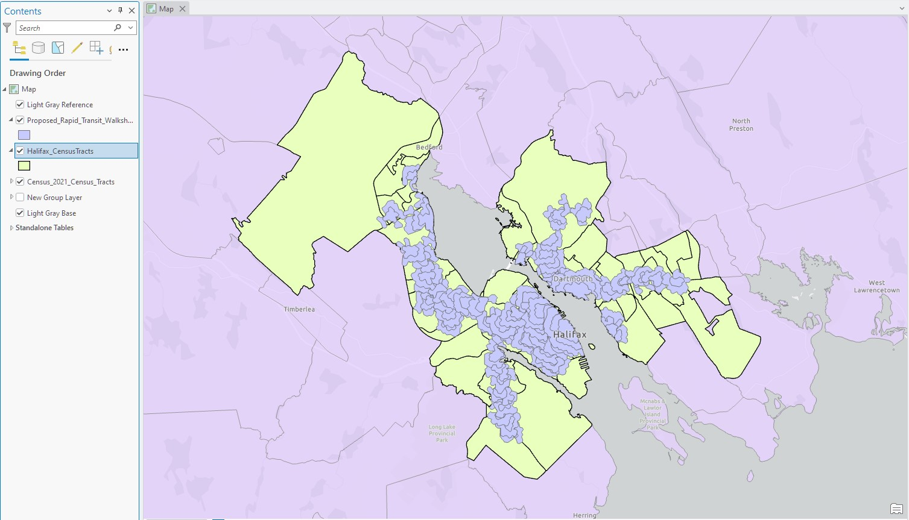  

The existing bus routes and stops were clipped to be within the extent of the study area and merged to the proposed network to create one dataset for transit routes for network analysis. The census tracts do not include the water body that runs through the city. This resulted in the route data having broken vectors on the bridges crossing the water. These bridges were repaired before analysis was done.

### Walksheds from Transit Stops 

The existing walksheds from City of Halifax was not used as it contained walksheds from the ferries. Two walksheds were calculated for visualizing the distance in minutes from existing and proposed transit bus stops. Both new walksheds were created using a walking network analysis in ArcGIS Pro with pedestrian accessible streets setting time thresholds of 5 minutes, 10 minutes, and 15 minutes. Overlapping walkshed were set to dissolve to simplify the data.  
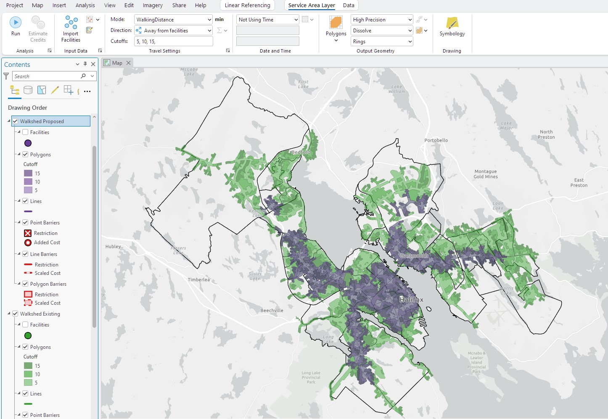  

### Commute Vector Routes from Table

Commuter data was obtained from a CSV dataset in Halifax's open data catalogue derived from census data that listed the origin and destination census tracts. The data was cleaned up to be relevant to the study area, and filtered down to only show the number of commuters whose primary mode of transportation is driving. This data was processed to be a line feature class with a record for each commute route vector between tracts represented in the data.  
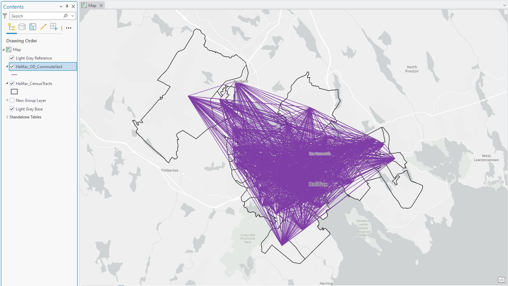  

### Create a Public Transit Data Model

GTFS files for the exsiting bus networks scheduke was pulled from the City of Halifax's Open Data Portal. The GTFS files for the proposed network was created using a custom script tool. This tool derived information from the city's Rapid Transit Strategy report to create a schedule for the proposed bus network.  
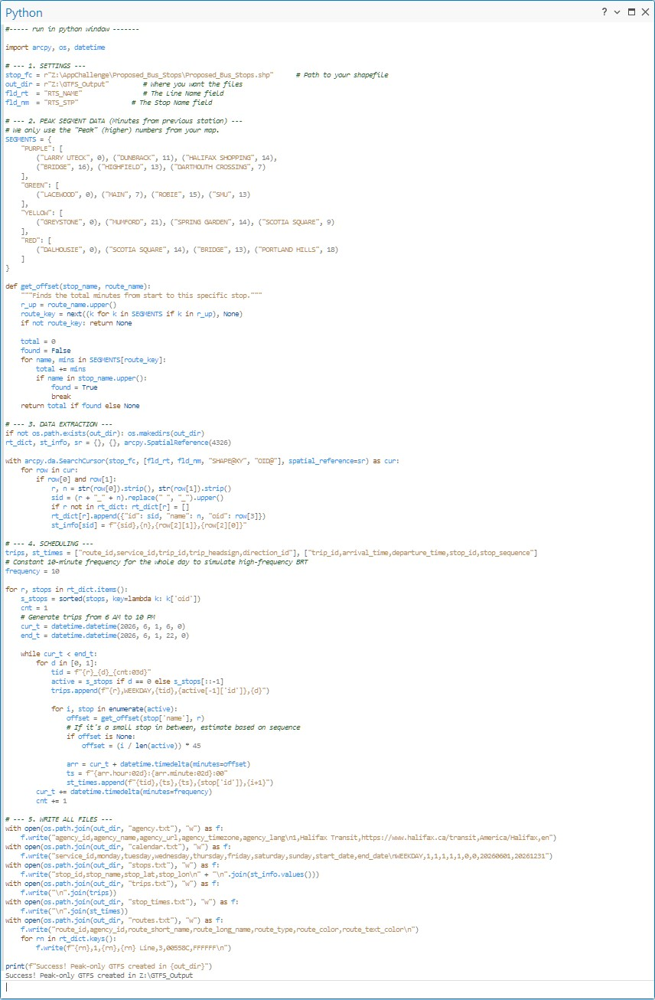  

The created GTFS file and the exisiting GTFS file from Halifax had a mismatch in the calendar start and end dates, resulting in both files not being used concurrently in the analysis. The start dates of the created GTFS file was adjusted to be within range of the existing GTFS files before the analysis was run.

Both sets of GTFS files along with the merged transit route lines were used to create a network dataset with the Public Transit Data Model tool, utlizing an XML template from the ESRI tutorial[^12]."  
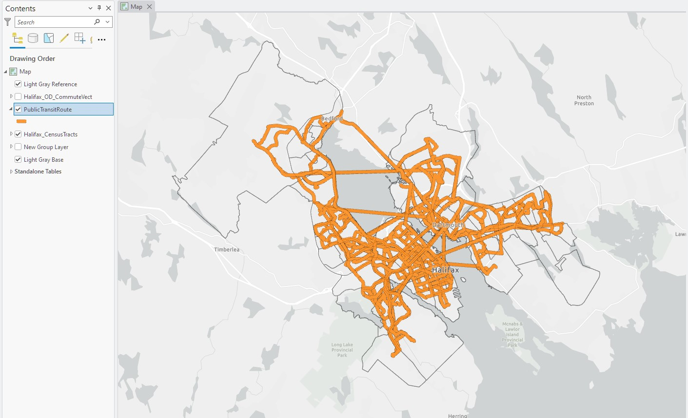  

### Create a Driving Network

An additional network based on the streets feature class was created for drive times to compare the drive and transit times. This layer was adjusted for commute times with a base ratio of 1.75x the base driving time, derived from a report that quantifies transit congestion[^13].  
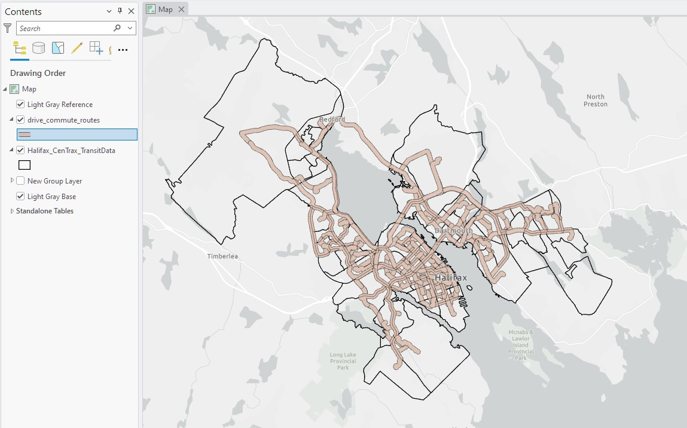  

### Analyze Transit Routes

The commute vectors were ran as origin-destination pairs in the Route tool, for both the Transit model and the Driving model.
The routes from the Network Dataset were exported as a public transit route feature class and intersected with the transit lines to calculate the length of transport on each mode (walk vs. bus). A scale factor of 1.25 was used to account for gaps in the intersect. 

The public transit route was joined to the commute vectors so the attribute table contained a field for transit time and length on each route vector. The driving network was also joined to the commute vectors so data for driving time and length could be pulled into new fields in the attribute table. Three additional fields were created on the commute vectors to indicate whether or not the route was within a 30 minute, 45 minute, or 60 minute transit threshold using a 'Y' or 'N'.  
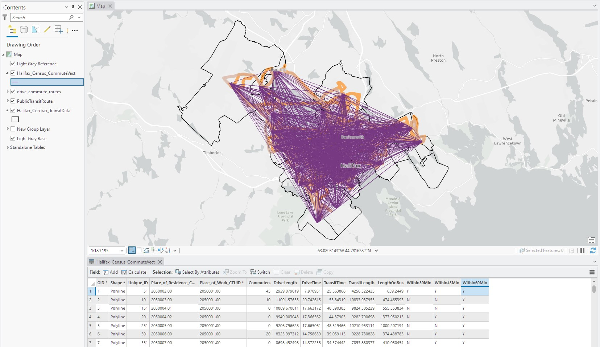  

### Calculate Emissions for Proposed Bus Network

The emissions were calculated on distance for the bus routes at a rate of 1.57 kg CO2 per km[^14]. When calculating bus emissions, the rate was divided by 50 as the average transit bus has a capaciity of 50 commuters, and scaled to meters as the length values of the data was in meters. This came out to a rate of 0.00003kg CO2 per m, and was doubled to assume two-way travel.  
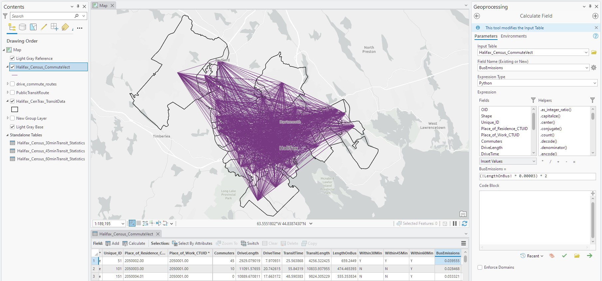  

Emissions for driving were determined to be at a rate of 0.248kg of CO2 per km, which represents a standard gas vehicle average[^15]. When calculating drive emissions, the rate was scaled to meters as the length values of the data was in meters. This came out to a rate of 0.000248kg CO2 per m, and was doubled to assume two-way travel.  
  

### Summarizing the data into Census Tracts

Summary statistics were run on the commute vectors to obtain the sum total of driving emissions for each census tract. Three more summary statistics were conducted grouping census tracts and 30/45/60 minute transit indicators to get total transit emissions and total commuters for each. The four summary statistics tables were joined to the census tract polygons to pull emissions data for driving and the three transit thresholds into the attribute table.
*Note: that the emissions were not scaled to total population due to inconsistencies with the census data responses and the stated population.*  
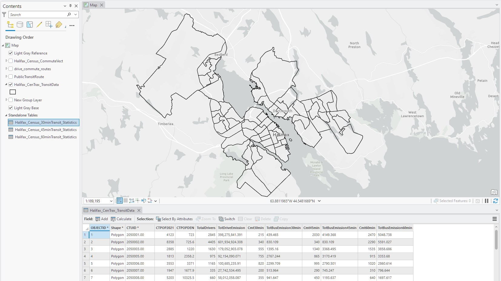  

After the data was loaded into ArcGIS Online at a later step, three fields were identified to be missing. These fields are the total remaining drivers for each time threshold. This field assumes all drivers whose routes do fall within the time thresholds choose to take public transit. It was calculated directly in ArcGIS Online using Calculate Field.  
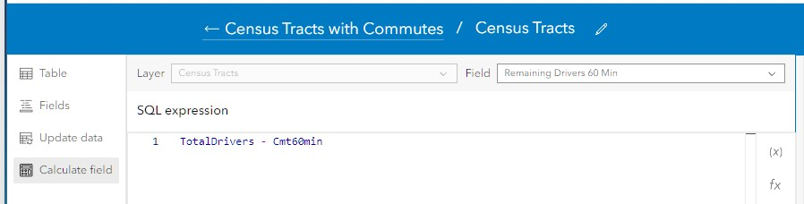  

### Relating the Data

A one-to-many relationship class was made in ArcGIS pro between the census tracts and the commuter route vectors using the Census Tract ID as the key. This allows for the select of census tracts in the app to display related commute vector records.  
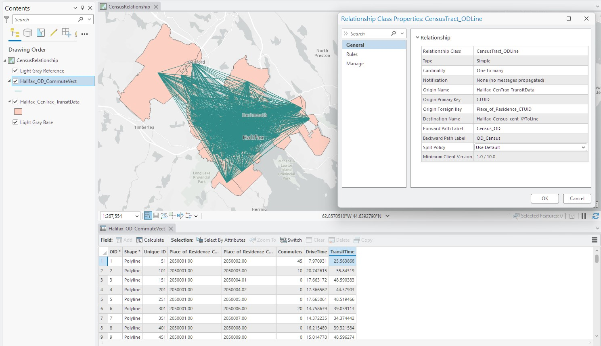  

Before sharing the data to ArcGIS Online, the fields for the commute vectors were simplified to only a few important fields such as the Route ID, Residence Census Tract, Work Census Tract, Number of Commuters, and the drive and transit times. A map with the related features was uploaded to ArcGIS Online as a web layer.  
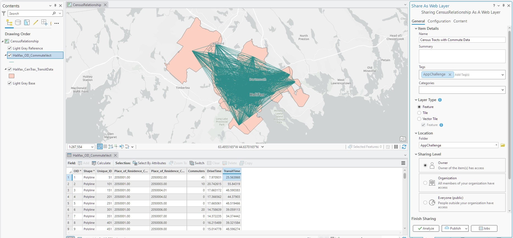  

### Calculating Theoretical Emissions with Change Bus Fleet

A custom script tool was used in ArcGIS Pro to calculate theoretical emissions based on user-specified parameters for proportions of Halifax's bus fleet that might be electric and/or hydrogen-diesel hybrid. The user also is prompted to select a time tolerance from a domain (30, 45 or 60) to determine how many drivers would be within a reasonable transit commute and could thus be counted towards potential savings in emissions. 

The reductions in emissions for the alternative fuels were defined as a ratio of the diesel emissions; they were considered to be 71.5% for diesel-hydrogen based on statements from the Halifax Transit authority [^16] and 80% for electric assuming Halifax continues on their transition to solar power for their bus fleet as proposed in their plan[^17]. This was based on an estimated calculation for emissions by KWh for their mid-transition energy grid [^18] and energy use rates of 2 KWh/km [^19]. This estimate was compared to the specifications of the manufacturer[^20] to verify.  
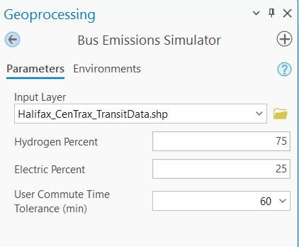  
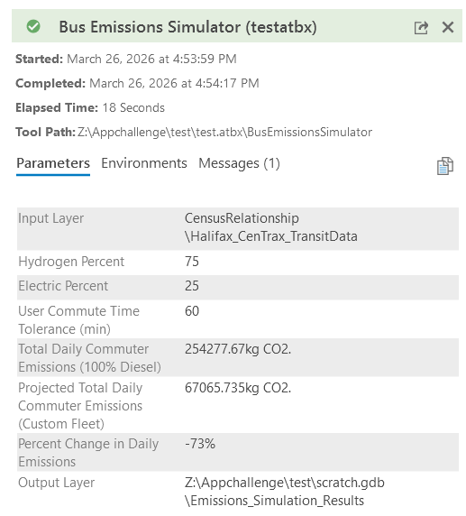  

# Sources

## Data 

### Layers used for network analysis

| Data Name | Data Type | Data Source |
| --- | --- | --- |
| `Rapid Transit Strategy` | `Text report (used for generation of GTFS)` | [Halifax Regional Municipality](https://www.halifax.ca/transportation/halifax-transit/rapid-transit-strategy) |
| `Transit Static Scheduling Data` | `GTFS (Text)` | [Halifax Regional Municipality](https://data-hrm.hub.arcgis.com/documents/704246ec1d9b407c89206b350500f5fd/explore) |
| `Street Centrelines` | `Shapefile (Line)` | [Halifax Regional Municipality](https://data-hrm.hub.arcgis.com/datasets/560fec412dd044b08ae52a8575a215d4_0/explore?location=44.651056%2C-63.587860%2C15) |
| `Transit Bus Routes` | `Shapefile (Line)` | [Halifax Regional Municipality](https://data-hrm.hub.arcgis.com/datasets/69adb7a88a4e4343bf5ae7c381f2d9af_0/explore?location=44.726514%2C-63.570870%2C10) |
| `Bus Stops` | `Shapefile (Point)` | [Halifax Regional Municipality](https://data-hrm.hub.arcgis.com/datasets/29de9d04a3454e11a1e0a1f78a27bc07_0/explore?location=44.808806%2C-63.543224%2C12) |
| `Proposed Rapid Transit Network` | `Shapefile (Line)` | [Halifax Regional Municipality](https://data-hrm.hub.arcgis.com/datasets/1424c257ff304c15991b5465c5d7f5cc_0/explore?location=44.649786%2C-63.596595%2C12) |
| `Proposed Bus Rapid Transit and Ferry Stops` | `Shapefile (Point)` | [Halifax Regional Municipality](https://data-hrm.hub.arcgis.com/datasets/52bde52e613e4f9491bc364aed291574_0/explore?location=44.657680%2C-63.596599%2C11) |
| `Network Dataset Template ` | `XML` | [Esri](https://pro.arcgis.com/en/pro-app/latest/help/analysis/networks/create-and-use-a-network-dataset-with-public-transit-data.htm) |

### Layers for analysis

| Data Name | Data Type | Data Source |
| --- | --- | --- |
| `Census 2021 Census Tracts` | `Shapefile (Polygon)` | [Halifax Regional Municipality](https://data-hrm.hub.arcgis.com/datasets/89aeb7e05c0047ebaf511e72bd66620c_0/explore?location=44.776253%2C-62.371440%2C7) |
| `Commuting Mode Share by Census Tract` | `CSV` | [Halifax Regional Municipality](https://data-hrm.hub.arcgis.com/datasets/d7fa5f369c134c30aeabacf0428cc688_0/explore) |

### Table for emissions calculator

| Transit type | Emissions per vehicle |
| --- | --- | 
| `Diesel bus` | `1.5kg/km` |
| `Electric bus (solar charge)` | `0.051`|
| `Standard vehicle` | `0.249kg/km` |

## Use of Generative AI

### GTFS Files
GEMINI AI was prompted to generate GTFS files for the new proposed transit routes that did not have full schedule information posted. GEMINI created a script to make all the required files based on information in a static report from the city of Halifax and the dataset of stops available from their open data portal. The prompt is as follows:
> I have two bus routes I want to combine into the same network. One is already in GTFS format with stop times, while the other is a proposed route with predicted stop times. I have the shapefile of the locations of the proposed stops. Can you write a Python script to generate a GTFS for the proposed route, using only peak times, no ferries, and interpolating time between stops based on the info provided in the proposal graphic? (graphic with proposed time between major stops uploaded)  
> 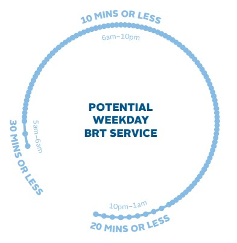 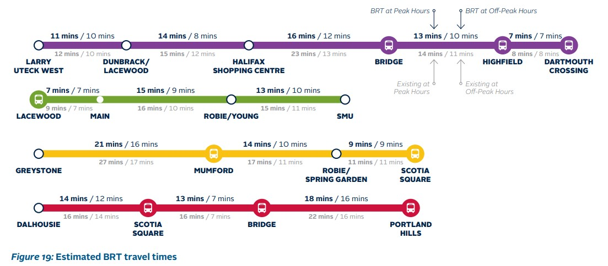  

### Custom script tool

GEMINI AI was used to provide structure to a custom script tool to simulate different emissions (diesel, hydrogen-hybrid, electric)
The prompts were as follows: 
> To create a script tool that can be referenced in an EXB analysis widget, how do I initialize the environment to reference a web map used in EXB rather than map view in active project?
Used to refine/perfect code script:
> How to let user select a time tolerance (30, 45 , 60) and dynamically adjust analysis based on this?

## Images and Video Sources

### App Images

| Uses | Creator | Source |
| --- | --- | --- |
| `Thumbnail` | `Harrison Haines` | [Pexels](https://www.pexels.com/photo/city-street-with-old-residential-buildings-5557967/) |
| `Favicon` | `meaicon` | [Flaticon](https://www.flaticon.com/free-icons/transit) |
| `App logo` | `HAJICON` | [Flaticon](https://www.flaticon.com/free-icons/transit) |

### Stock video

| Description | Creator | Link |
| --- | --- | --- |
| `Vehicle Emissions` | `Kelly` | [Pexels](https://www.pexels.com/video/white-smoke-from-exhaust-6160044/) |
| `Busy Road and Train` | `Kindel Media` | [Pexels](https://www.pexels.com/video/drone-video-of-a-busy-road-9699802/) |
| `A Man Sitting on His Wheelchair while Listening to Music` | `Kampus Production` | [Pexels](https://www.pexels.com/video/a-man-sitting-on-his-wheelchair-while-listening-to-music-8774843/)
| `Woman Using Laptop inside a Train` | `Mart Production` | [Pexels](https://www.pexels.com/video/woman-using-laptop-inside-a-train-7251032/) |
| `Doctor Providing Compassionate Patient Care` | `Adventist Asia` | [Pxels](https://www.pexels.com/video/doctor-providing-compassionate-patient-care-30141926/)
| `Zero Emission Bus` | `Kelly` | [Pexels](https://www.pexels.com/video/a-bus-passing-by-the-street-3999359/)  |
| `Traffic on hwy` | `Mike Bird` | [Pexels](https://www.pexels.com/video/time-lapse-of-cars-2109463/)  |
| `Aerial city (Halifax?)` | `Mike S` | [Pexels](https://www.pexels.com/video/drone-footage-of-buildings-5587889/) |
| `BRT Grey bus` | `RDNE Stock Project` | [Pexels](https://www.pexels.com/video/man-working-while-in-a-bus-stop-8052478/) |
| `Bikers on Road` | `Lennart Wittstock` | [Pexels](https://www.pexels.com/video/people-cycling-4277525/) |
| `Nova Scotia Harbour with Tourists` | `RecEverywhere` | [Pexels](https://www.pexels.com/video/lively-canadian-harbor-with-summer-tourists-34892616/) |
| `People walking in NYC` | `Karma Rayshar` | [Pexels](https://www.pexels.com/video/manhattan-5th-avenue-people-crowd-26732751/)|
| `People at bus terminal` | `Sururi Ballıdağ `| [Pexels](https://www.pexels.com/video/busy-city-bus-stop-at-dusk-with-commuters-36370003/)|
| `People at on commuter train` | `Nazmi Javier `| [Pexels](https://www.pexels.com/video/crowded-commuter-train-journey-interior-30921279/)|
| `Subway passing` | `Coverr-Free-Footage`| [Pixabay](https://pixabay.com/videos/subway-metro-departing-underground-2299/)|
| `Departing Metrobus in Separate Lane` | `Sururi Ballıdağ `| [Pixabay](https://www.pexels.com/video/istanbul-urban-transit-busy-day-on-metrobus-lane-29152589/)|
| `News Segment on Halifax Congestion` | `Haley Ryan` | [CBC](https://www.youtube.com/watch?v=LbpV6oj310s)|

### Images from reports

| Description | Page # | Citation |
| --- | --- | --- |
| `Route Map for BRT` | *`pg 14`* | [Strategic Roadmap 2025-2028. Regional Municipality of Halifax, 2026](https://www.halifax.ca/sites/default/files/documents/transportation/halifax-transit/halifax-transit-strategic-roadmap.pdf) |
| `Cover Page` | *`pg 1`* | [Rapid Transit Strategy. Regional Municipality of Halifax, 2020](https://www.halifax.ca/media/69884) |
| `Goals` | *`pg 12`* | [Rapid Transit Strategy. Regional Municipality of Halifax, 2020](https://www.halifax.ca/media/69884)  |
| `Tranist-oriented Complete Streets` | *`pg 38`* | [Rapid Transit Strategy. Regional Municipality of Halifax, 2020](https://www.halifax.ca/media/69884) |

## References
[^1]:  Tiznado-Aitken, Ignacio, Zehui Yin, and Steven Farber. "Towards Sustainable Neighbourhoods? Tensions and Heterogeneous Transport Priorities among Suburban Residents." Transportation Research Part D: Transport and Environment 138 (January 2025): 104514. https://doi.org/10.1016/j.trd.2024.104514. 

[^2]: United Nations. "What Is Sustainable Transport and What Role Does It Play in Tackling Climate Change? | UNDP Climate Promise." February 3, 2025. https://climatepromise.undp.org/news-and-stories/what-sustainable-transport-and-what-role-does-it-play-tackling-climate-change. 

[^3]: Shen, Kevin, Dave Cooke, Emmanuell De Barros, Mike Christensen, Kim Mitchell, and Dorothy Wiley. Freedom to Move: Investing in Transportation Choices for a Clean, Prosperous, and Just Future. Union of Concerned Scientists, 2024. https://doi.org/10.47923/2024.15594; 

[^4]: Homem de Almeida Rodriguez Correia, Gonçalo. "Increasing Transport Sustainability through the Integration between Power Grids and Electric Mobility Systems." Npj Sustainable Mobility and Transport 2, no. 1 (2025): 17. https://doi.org/10.1038/s44333-025-00036-6. 

[^5]: Kang, Gayoung, Minje Choi, Joonsik Jo, Juhyeon Kwak, Yoonjung Jang, and Seungjae Lee. "Environmental Benefit Comparison between Super Bus Rapid Transit and Tram Systems." Cleaner Engineering and Technology 15 (August 2023): 100655. https://doi.org/10.1016/j.clet.2023.100655. 

[^6]: Strategic Roadmap 2025-2028. Regional Municipality of Halifax, 2026. https://www.halifax.ca/sites/default/files/documents/transportation/halifax-transit/halifax-transit-strategic-roadmap.pdf.  

[^7]: "Halifax Buses Are Often Late and Overcrowded. Here’s What the City Is Doing about It." CBC. CBC News, 2024. 374.274. https://www.cbc.ca/player/play/video/9.6516220.  

[^8]: Rapid Transit Strategy. Regional Municipality of Halifax, 2020. https://www.halifax.ca/media/69884. 

[^9]: Government of Canada, Canada Energy Regulator. "CER – Nova Scotia Energy Profile." March 19, 2026. https://www.cer-rec.gc.ca/en/data-analysis/energy-markets/province-territory-energy-profiles/nova-scotia.html. 

[^10]: US EPA, OAR. "Greenhouse Gas Emissions from a Typical Passenger Vehicle." Overviews and Factsheets. January 12, 2016. https://www.epa.gov/greenvehicles/greenhouse-gas-emissions-typical-passenger-vehicle. 

[^11]: Rent, Suzanne. "Halifax Transit Charges Ahead to Get Fleet of Electric Buses Ready for next Winter." Halifax Examiner, February 16, 2024. https://www.halifaxexaminer.ca/government/city-hall/halifax-transit-charges-ahead-to-get-fleet-of-electric-buses-ready-for-next-winter/. 

[^12]: "Create and Use a Network Dataset with Public Transit Data—ArcGIS Pro | Documentation." Accessed March 26, 2026. https://pro.arcgis.com/en/pro-app/latest/help/analysis/networks/create-and-use-a-network-dataset-with-public-transit-data.htm. 

[^13]: Halifax Traffic Report. TomTom, 2026. Accessed March 25, 2026. https://www.tomtom.com/traffic-index/city/halifax. 

[^14]: Merkisz, Jerzy, Paweł Fuć, Piotr Lijewski, and Jacek Pielecha. "Actual Emissions from Urban Buses Powered with Diesel and Gas Engines." Transportation Research Procedia, Transport Research Arena TRA2016, vol. 14 (January 2016): 3070–78. https://doi.org/10.1016/j.trpro.2016.05.452. 

[^15]: U.S. Energy Information Administration (EIA). "FAQs - How Much Carbon Dioxide Is Produced per Kilowatthour of U.S. Electricity Generation?" EIA Independent Statistics and Analysis. Accessed March 25, 2026. https://www.eia.gov/tools/faqs/faq.php?id=74&t=11. 

[^16]: Ryan, Haley. "Halifax Launching Dual-Fuel Hydrogen Bus Project This Year." CBC News, May 28, 2025. https://www.cbc.ca/news/canada/nova-scotia/halifax-launching-dual-fuel-hydrogen-bus-project-this-year-1.7546238.  

[^17]: Halifax Regional Municipality. "Zero Emission Bus Project." Halifax City. Accessed March 24, 2026. https://www.halifax.ca/transportation/halifax-transit/zero-emission-bus-project. 

[^18]: EcoFlow. "GHG Emissions per kWh: Coal, Gas, Wind & Solar." January 29, 2026. https://www.ecoflow.com/ca/blog/power-generation-emissions-by-source. 

[^19]: Lipman, Timothy E. "Recent Developments and Challenges with Electric Bus Implementation for Transit Fleets." Current Sustainable/Renewable Energy Reports 12, no. 1 (2025): 19. https://doi.org/10.1007/s40518-025-00267-8. 

[^20]: "Nova LFSe+." Novabus, n.d. Accessed March 25, 2026. https://novabus.com/en/blog/bus/lfse-plus/.
