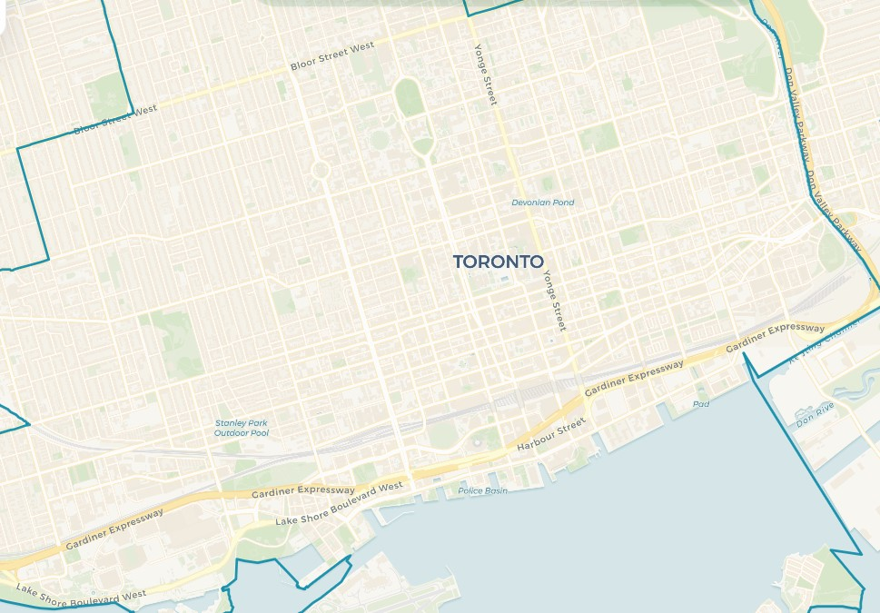
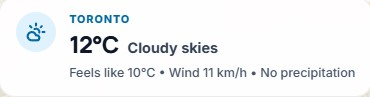
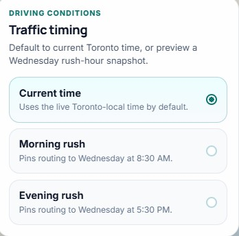
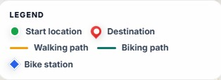
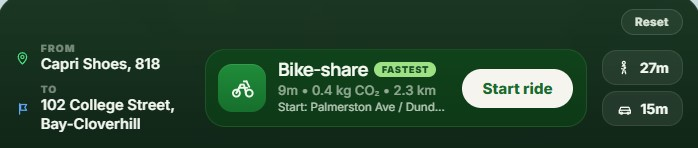
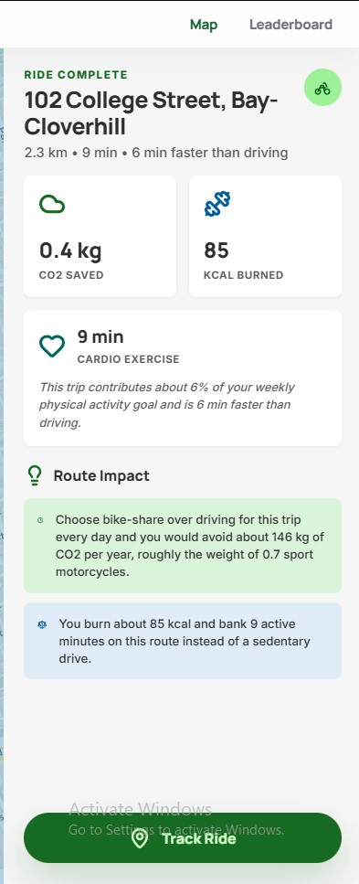
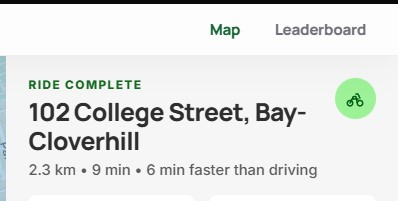
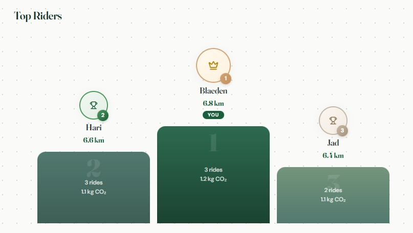
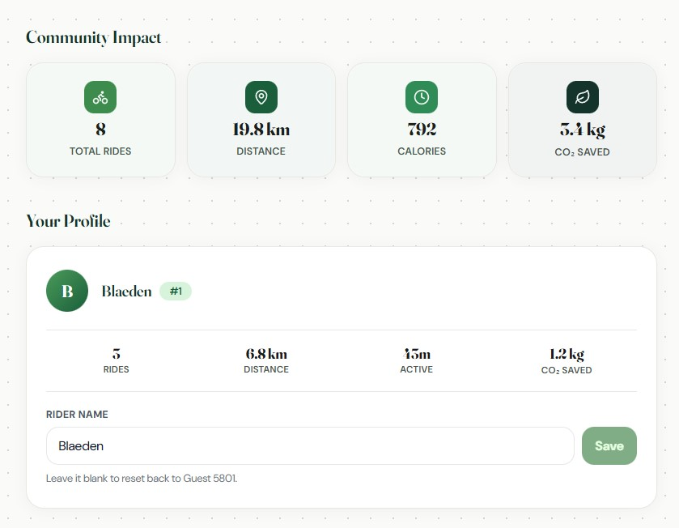

# Stride (ESRI-App-Challenge 2026)

## App Link:


  <a href="https://stride.jadportfolio.com/" target="_blank">
    <b>Launch Stride </b>
  </a>

[Download Video Here](./app/public/Images/ProjectVideo.mp4)

## Team: GeoTrio

- Jad El Asmar
- Blaeden Kohout
- Hari Patel

<p align="center">
  
</p>

## Mission Statement

Transportation plays a pivotal role in providing access to opportunity, yet the actual cost and efficiency of mobility are often misinterpreted. 
For example, although tools such as Google Maps or Waze include traffic and weather conditions, their main focus is designed to optimize routes 
for efficiency rather than actively encouraging sustainable or alternative modes of transportation. Due to this, users are not actively encouraged 
to assess travel options in relation to environmental sustainability, health, or overall system efficiency.

This application aligns with global efforts such as the UN Decade of Sustainable Transport (2026-2035), which focuses on improving access while 
reducing environmental and social impacts through more sustainable mobility systems [(United Nations, 2023)](https://sdgs.un.org/topics/transport). Instead of focusing on new technologies,
our approach centers around optimizing the full potential of existing transportation modes, specifically walking and cycling by making them more visible and comparable to driving. 

For example, in high density cities such as Toronto, active modes of transportation could be more suitable for short-distance travel. However, 
individuals often default to driving due to misinterpretations about drive time and convenience. Research done by the City of Toronto in their _Road To Health_
article states that cycling is the fastest mode of transportation for trips that are between 5 to 7km, while walking can be a rival for even driving for very 
short trips [(City of Toronto, 2012)](https://www.toronto.ca/wp-content/uploads/2019/09/9682-Road-to-Health_ImprovingWalking_April2012.pdf). In addition, traffic congestion has a large impact on real-world traffic times. During peak travel times, trips can take 
almost as much as two times as long as free-flow conditions [(TomTom, 2025)](https://www.tomtom.com/traffic-index/). These factors underline the need for tools that reflect real-world conditions rather than fixed assumptions. 

Stride does exactly that, it addresses this gap by providing a dynamic, data-driven comparison of transportation options. Stride uses a different travel-time model for each mode instead of relying on one simple assumption. Driving estimates are based on the road network, speed limits, turn delays, time-of-day traffic multipliers, and a current-weather multiplier. Cycling estimates use the road network with a time-of-day multiplier, while walking estimates use the sidewalk network with a steady walking speed.

<p align="center">
<b>Driving Adjusted Time = Base Road Time × Time-of-Day Multiplier × Weather Multiplier + Junction Delay</b>
</p>

<p align="center">
<b>Cycling Adjusted Time = Base Cycling Time × Time-of-Day Multiplier</b>
</p>

<p align="center">
<b>Walking Adjusted Time = Base Sidewalk Time + Connector Time</b>
</p>

Stride offers realistic travel times based on cycling, walking, and driving while considering network-based routing and time-of-day congestion patterns.
This will allow for more accurate and reliable travel times, allowing users to make decisions based on what they will actually experience rather than being reliant on estimations. 
Beyond travel time, Stride promotes sustainable decision-making by providing the user information about the CO2 emissions in their trip and the amount of calories burnt per trip.
By providing the user with this information, they are able to understand not only the faster option but the option that is environmentally friendly and beneficial to 
personal health [(World Health Organization, 2020)](https://www.who.int/publications/i/item/9789240015128). Thus, Stride enables users to make sustainably informed travel decisions by comparing realistic travel times 
alongside providing CO2 emissions and calories burnt. By demonstrating the true viability of walking and cycling, Stride motivates a shift towards more sustainable, efficient, and healthier transportation methods.

## Statement of Characteristics

The main purpose of the Stride application is to give users an accurate way to understand transportation modes by comparing multiple travel options, including walking, cycling, and driving routes within Downtown Toronto. The application is designed to evaluate the best travel route by taking into consideration real-world factors such as network geometry, time of day, and current weather conditions for supported modes. Specifically, users are able to compare how route times change under different traffic assumptions, helping them choose the most efficient mode of transportation for their needs. 

A key feature of the Stride application is its focus on sustainability. For every route, Stride estimates the amount of carbon dioxide emissions, which gives users the ability to actively compare the environmental impact based on travel methods. For instance, for a 2km distance, an individual can see that walking or cycling can produce lower CO2 emissions compared to a car. This encourages users to choose sustainable options when travelling within Downtown Toronto. Stride serves as a support tool that empowers users to make informed and efficient choices on the go, all while challenging the idea that active transportation such as walking and cycling are less efficient compared to driving. 

## Key Features

- Multi-modal route comparison (walking, cycling, driving)
- Time-of-day traffic adjustments for driving and cycling
- Current-weather travel time adjustment for driving
- Using custom routing based on Lowest Cost Algorithm
- CO₂ emissions estimation per trip
- Logs total trips and data
- Leaderboard to show highest user CO2 emission savings

## Stack

- Next.js 16 with the App Router
- React 19
- ArcGIS Maps SDK for JavaScript
- Plain CSS
- SQLite Database

## Local Development

1. Install dependencies:

   ```bash
   pnpm install
   ```

2. Start the app:

   ```bash
   pnpm dev
   ```

4. Open [http://localhost:3000](http://localhost:3000).

The home page renders a Toronto-centered ArcGIS `MapView` using a custom
CARTO basemap over `WebTileLayer`, so no ArcGIS API key is required for the basemap.

## Scripts

- `pnpm dev` starts the Next.js development server.
- `pnpm build` builds the production bundle.
- `pnpm start` runs the production server.
- `pnpm lint` runs ESLint.
- `pnpm typecheck` runs the TypeScript compiler in no-emit mode.

## Project Structure

- `./app/app/layout.tsx` sets the global layout and metadata.
- `./app/app/page.tsx` renders the centered map shell.
- `./app/components/TorontoMap.tsx` creates an ArcGIS `MapView` centered on Toronto,
  using a CARTO basemap and local route overlays.
- `./app/app/globals.css` contains the app shell and map panel styling.

## Methodology & Limitations

## Methodology

### Routing Methodology
Stride builds a separate route network for each travel mode using the project datasets. Driving routes use the downtown road network, follow one-way streets, use posted speed limits when available, and add extra time for turns at intersections.

Cycling routes currently use the road network with a steady cycling speed and can also include a Bike Share Toronto trip when stations are available near the start and end points.

Walking routes use the sidewalk dataset only, with short connector segments added between where the user clicks and the nearest snapped sidewalk location.

### Municipal Boundary
Stride uses a custom-defined downtown Toronto study area to maximize its impact in showing the benefits of efficiency in active transportation methods. This was created by selecting and merging key central neighbourhoods from the City of Toronto’s open data, including areas such as Yonge-Bay Corridor, Kensington-Chinatown, Harbourfront-CityPlace, and Trinity-Bellwoods. These neighbourhoods were chosen to represent the dense urban core where congestion is highest and active transportation methods like walking and cycling are most competitive with driving.

### Traffic Assumptions
Traffic is modeled as a time-of-day adjustment in the Toronto time zone instead of using a live traffic feed. The current-time option uses the selected departure time, while the morning and evening presets simulate typical weekday rush-hour conditions. In the current version of the app, driving uses half-hour traffic multipliers and cycling uses a smaller slowdown factor based on time of day. Walking stays close to a fixed-speed estimate except for the short connector distance at the start and end.

The driving traffic curve was insipred by the City of Toronto's [Traffic Volumes - Midblock Vehicle Speed, Volume and Classification Counts](https://open.toronto.ca/dataset/traffic-volumes-midblock-vehicle-speed-volume-and-classification-counts/) dataset, which contains short-term traffic counts recorded in 15-minute intervals and includes observed vehicle speeds on road segments across the city. In our method, these observations were grouped into half-hour time bins and compared with overnight free-flow conditions to create a congestion multiplier for each time period.

<p align="center">
<b>Time-of-Day Multiplier = Observed Travel Time / Free-Flow Travel Time</b>
</p>

Trip-level congestion data from the official [TomTom Traffic Index for Toronto](https://www.tomtom.com/traffic-index/city/toronto) shows the same general pattern: in 2025, TomTom reports an average 10 km trip of 34 min 5 s in the evening rush hour compared with about 16 min 10 s around 4:00 a.m. This means peak travel can be about twice as slow as overnight travel, which supports using congestion multipliers instead of one fixed drive-time assumption.

Because the Toronto midblock dataset measures speed at specific road segments instead of full trips, it does not fully capture traffic light delay, queueing, or turning delay on its own. For that reason, traffic multipliers based on these speed observations should be understood as general congestion adjustments rather than exact trip predictions.

Cycling is modeled with a smaller time-of-day effect because bikes are usually slowed down more by traffic lights and intersections than by vehicle traffic jams. This means cycling times can still change during the day, but usually not as much as driving times.

### Weather Assumptions
Current weather is fetched from [Open-Meteo](https://open-meteo.com/) using temperature, feels-like temperature, precipitation, weather code, wind speed, and day/night status. Right now, weather directly adjusts driving travel time through a multiplier based on rainfall or snowfall, wind, and severe conditions such as fog, snow, and storms.

These adjustments are supported by the U.S. Federal Highway Administration's road weather guidance. [FHWA reports](https://ops.fhwa.dot.gov/weather/resources/publications/fhwa/weatherinfostcsi.pdf) that on freeways, heavy rain can reduce average speed by about 3 to 16 percent and heavy snow can reduce average speed by about 5 to 40 percent. On arterial roads, wet pavement can reduce speeds by 10 to 25 percent and snowy or slushy pavement can reduce speeds by 30 to 40 percent. These findings support using weather multipliers to increase travel time during bad weather instead of assuming roads always operate like they do in clear conditions.

<p align="center">
<b>Weather Multiplier = Weather-Affected Travel Time / Clear-Condition Travel Time</b>
</p>

Weather does not currently reroute around closures, flooding, or hazards, and it does not yet change walking or cycling travel times.

## Limitations

### Traffic Data Approximation
Due to limitations we experienced in accessing real-time traffic data (locked behind paywalls) our application instead uses a modeled approach to estimate driving conditions. Assumed traffic data was calculated by observing historical patterns, including time of day (e.g., rush hour vs. off-peak), day of the week, and weather conditions (full breakdown in methodology section). These factors are applied through a dynamic weighting system to approximate realistic travel times. While this approach went through hours of testing in order to produce reasonable and consistent results, it still won’t account for unexpected events such as accidents, road closures or abrupt traffic spikes that would be outliers compared to typical traffic. As a result, real-world travel times may occasionally differ from those displayed in the application, particularly with driving times.

### Bike Share Availability Assumptions
Our application incorporates Bike Share locations situated within downtown Toronto to generate cycling routes, showing the nearest locations at the origin point and destination. However, it does not account for real time availability of these services, for instance, the nearest bike dock location may not have any available bikes at the time. 

### Human Behavior & Estimation Variability
Travel times for walking and cycling are based on average speeds and conditions, CO2 emissions and calories burnt are likewise only average estimations of values. Individual differences will lead to slight variations in estimated values. 

## User Guide
The aim of this section is to provide an overview of how to use the application as well as the numerous features our app provides. The steps that follow give a chronological order of the features users will typically see/click on and give additional insights to the outputs generated. 

For the best experience, it is recommended to use the application on a desktop or laptop device. While the app is also compatible with mobile devices, the layout and interactions are optimized for larger screens. All screenshots and feature descriptions shown below reflect the desktop version of the application.

#### Setting Destination Prompt

<p align="center">
  
</p>

Located at the top center of the app, users are prompted to select a destination by clicking directly on the map. This interaction sets the endpoint for route comparisons and allows users to quickly begin exploring different transportation options.

#### Selecting Start and Destination

<p align="center">
  
</p>

Users can select their starting and destination points by clicking directly on the map. When a user clicks on the map, the application automatically snaps the selected point to the nearest road or pathway. This ensures that routes are generated accurately, even if a user clicks on a building, park, or other non-road location. Once both points are selected, the application immediately generates and displays route comparisons across different transportation modes.

#### Real-Time Weather Integration

<p align="center">
  
</p>

Located at the top left of the map, users can see real time weather conditions within Toronto. This includes details such as temperature, wind speed and precipitation. This information is displayed for reference across the app and is currently used directly in the driving travel-time model to reflect adverse conditions such as heavy rain, snow, fog, or strong wind.

#### Time of Day Parameter

<p align="center">
  
</p>

Located in the bottom-left corner of the application, users can view and adjust the time-of-day parameter used in route calculations. By default, the application uses the current local time in Toronto to reflect real-time conditions.

#### Changing Time of Day and Conditions Feature

<p align="center">
  
</p>


By selecting this option, a panel opens in the center of the app that allows users to choose between current time, morning rush hour, or evening rush hour. These settings simulate different time-of-day conditions and are currently applied to driving and cycling estimates. This allows users to explore how travel efficiency changes throughout the day without relying on a live traffic feed.

#### Dynamic Map Legend

<p align="center">
  
</p>

After selecting the desired location by clicking the to and from streets, a dynamic legend will pop up. Located on the left side of the application under the weather, the legend provides users with a clear understanding of the map’s symbols, including start and destination points, as well as the selected route type. Moreover, the legend dynamically updates based upon the chosen mode of transportation by displaying different route styles for cycling, walking and driving. 

In addition, when cycling is selected, the application also incorporates Bike Share Toronto data to identify the nearest available stations to both the start and destination points. The route is then adjusted to guide users to the closest bike station, along the cycling path, and from the final station to their destination. This ensures a realistic and accessible biking route that reflects how bike-share systems are used in real-world scenarios. 

#### Route Comparison Panel

<p align="center">
  
</p>

At the middle of the bottom of the app, the route comparison panel gives users detailed information about the route they selected. Once the start and end destination is selected, the panel displays the estimated travel time for each of the three modes. In addition, the fastest option is highlighted. 

On the right side of the panel, users can select the different options to see how the route changes. Selecting a mode updates the map and reveals additional route details, allowing users to compare how travel time and efficiency vary between options. The reset button on the top right lets users quickly remove their selected points. Finally, the “Start Ride” button when pressed opens up a unique dashboard that gives additional information and features.

#### Impact Summary

<p align="center">
  
</p>

After clicking the “Start Ride” button on the bottom panel, an impact summary will appear on the right side of the screen. This will provide users with a wealth of information to look at. Firstly, users will see key information such as the distance, estimated trip duration and efficiency comparison to driving. In addition, users will be able to see more about the environmental and health impacts of their choices, showing users their Co2 emissions saved or generated depending on travel type, and the approximate calories they burned. 

Furthermore, the panel has a “Route Impact” section. This is used to help translate their metrics into further insights. For instance, users can better understand the real-world benefits of their choices. This includes long-term environmental impact and contributions to personal physical activity, encouraging more sustainable and health-conscious travel decisions.

Finally at the bottom of the panel is the “Track Ride” section. In which, the user can click the button to log their trip. Once logged, the application records the selected journey and adds it to the user’s personal statistics and the overall leaderboard.

#### Leaderboard & Community Impact

<p align="center">
  
</p>

<p align="center">
  
</p>

<p align="center">
  
</p>

On the top right of the insights panel, there will be an option to open up the leaderboard. At the top of the page users can see the community impact field which aggregates metrics such as total rides, distance, calories and co2 emissions saved. This field helps to show how individual users' contributions can lead to an overall massive impact. 

Below this, the User Profile section summarizes the individual user’s activity, including number of rides, total distance, active time, and CO₂ savings. Users also have the option to personalize their experience by entering a custom rider name.

Finally, at the bottom of the page lies the Top Rider leaderboard. This showcases the users who have had the greatest contribution to the environment by choosing active transportation modes. This feature introduces a sense of competition and motivation, encouraging users to make more sustainable transportation choices.


## Data Sources

| Dataset | Type | Description / Purpose | Projection | Source | Format |
|--------|------|----------------------|-----------|--------|--------|
| Ontario Road Network (ORN) – Road Net Element | Polyline (Network) | Used to represent the road network within the downtown study area for generating driving routes and supporting travel time comparisons. | WKID: 3162 | [Ontario Ministry of Natural Resources and Forestry](https://www.ontario.ca/page/ministry-natural-resources-and-forestry) | Feature Class (File Geodatabase) |
| Toronto Sidewalk Inventory | Polyline | Used to represent pedestrian infrastructure and sidewalk availability along transportation corridors, supporting walking route analysis within the downtown study area. | WKID: 4326 | [City of Toronto Open Data – Sidewalk Inventory](https://open.toronto.ca/) | Shapefile |
| Downtown Toronto Boundary | Polygon | Custom study area boundary used to define the downtown Toronto analysis area and clip project datasets to the area of interest. | WKID: 4326 | [City of Toronto Open Data – Neighbourhoods](https://open.toronto.ca/) | Feature Class (derived from Shapefile) |
| CARTO Voyager Basemap | Raster web tiles | Used as the visual basemap beneath route overlays to provide geographic context for the Downtown Toronto study area. Loaded in ArcGIS through `WebTileLayer`, so no ArcGIS API key is required for this basemap. | Web Mercator (XYZ web tiles) | [CARTO Basemaps](https://carto.com/basemaps/) with data from [OpenStreetMap contributors](https://www.openstreetmap.org/copyright) | PNG raster tiles |
| Toronto Bike Share Locations | Point | Used to locate Bike Share Toronto stations and support active transportation route comparisons within the downtown study area. | WKID: 3857 | [City of Toronto Open Data – Bike Share Toronto](https://open.toronto.ca/) | JSON (GBFS) |
| Road Network Junctions | Point | Derived dataset representing road network intersections used to support routing and network connectivity analysis within the downtown study area. | WKID: 4617 | Derived from [Ontario Road Network (OMNRF)](https://www.ontario.ca/page/ministry-natural-resources-and-forestry) | Feature Class |

### Methodology References

- [City of Toronto - Traffic Volumes - Midblock Vehicle Speed, Volume and Classification Counts](https://open.toronto.ca/dataset/traffic-volumes-midblock-vehicle-speed-volume-and-classification-counts/)
- [TomTom Traffic Index - Toronto](https://www.tomtom.com/traffic-index/city/toronto)
- [FHWA - How Do Weather Events Affect Roads?](https://ops.fhwa.dot.gov/weather/roadimpact.htm?cclocation=sc)
- [FHWA - Rain and Flooding](https://ops.fhwa.dot.gov/weather/weather_events/rain_flooding.htm)
- [FHWA - Snow and Ice](https://ops-dr.fhwa.dot.gov/weather/weather_events/snow_ice.htm)
- [FHWA - Weather in the Infostructure](https://ops.fhwa.dot.gov/weather/resources/publications/fhwa/weatherinfostcsi.pdf)

### Video Sources

- [Aerial View of Nighttime City Traffic Flow](https://www.pexels.com/video/aerial-view-of-nighttime-city-traffic-flow-35280393/)
- [Night Traffic and Pedestrians](https://www.pexels.com/video/night-traffic-and-pedestrians-in-istanbul-29969146/)
- [Pedestrians Walking Amidst Congestion](https://www.pexels.com/video/istanbul-urban-transit-busy-day-on-metrobus-lane-29152589/)
- [Man Sitting in Car](https://www.pexels.com/video/a-man-getting-out-of-a-car-9520981/)
- [Downtown Traffic Jam](https://www.pexels.com/video/video-of-cars-on-the-road-4236791/)
- [Zooming Walking in City](https://www.pexels.com/video/casual-stroll-on-urban-sidewalk-in-daylight-33632016/)
- [Car Driving in City](https://www.pexels.com/video/the-interior-of-a-car-at-night-with-lights-on-18616132/)
- [Charging Electric Vehicle](https://www.pexels.com/video/charging-an-electric-car-4817952/)

### Photo Sources

- [Efficiency Icon](https://www.flaticon.com/free-icon/efficiency_10931491)
- [Habits Icon](https://www.flaticon.com/free-icon/habits_8711262)
- [UN Sustainable Transport Icon](https://wwf.panda.org/wwf_news/?15475966/WWF-joins-global-call-to-advance-sustainable-transport-under-new-UN-decade)
- [UN Sustainable Development Goals Icons](https://www.un.org/sustainabledevelopment/health/)
