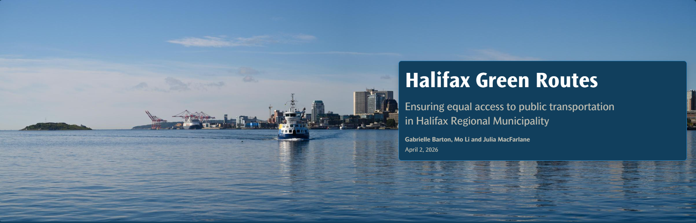

# Halifax Green Routes
## Team
- Gabrielle Barton
- Julia MacFarlane
- Mo Li
# Mission Statement 
Public transportation is quicky becoming one of the most sustainable options for travel, yet unequal distribution of infrastructure raises important questions of equity. Following a significant population increase over the last decade, Halifax, Nova Scotia has experienced increasing pressure on its transportation system. The current Halifax transit service serves over 17 million passengers annually, yet many communities may still lack adequate access. This project aims to examine Halifax population density and to identify communities that might have limited access to bus routes, aiming to address transit equity gaps that exist within the region. 

# Statement of Characteristics
Halifax is experiencing an unprecedented population boom, with rapid growth and new developments fundamentally reshaping the urban landscape. As the city expands, ensuring that public infrastructure keeps pace with housing is a critical challenge. Current spatial analysis reveals that significant portions of the population are currently underserved, with many residents unable to reach a public transit stop within a standard 10-minute walking distance. This gap in the network limits mobility and creates a reliance on private vehicles. 

To address these inequities, we conducted a comprehensive multi-criteria analysis that integrated population density, the location of new residential buildings, and the existing infrastructure of bus stops and routes. By mapping these variables, we identified specific "transit deserts" where the demand for service far exceeds current supply. 

Based on these findings, our proposal introduces four new strategic bus routes designed to bridge these gaps. These routes include carefully placed bus stops that optimize coverage and bring thousands of residents back within the essential 10-minute walking threshold. By prioritizing data-backed connectivity, this plan not only supports Halifax’s immediate growth but also fosters a more sustainable, accessible, and equitable transit future for the entire municipality. 

# Explore the App
Access the Storymap : [Ensuring equal access to public transportation in Halifax Regional Municipality](https://storymaps.arcgis.com/stories/0fa437d340ef443e9d6e14d96c112154)

Access the App : [Public Transit Accessibility in Halifax Regional Municipality ](https://experience.arcgis.com/experience/21b69d9f55bc4d22ab6b44d2b60861ca)
# Open Source Data
### Data Used 
| Data Name | Data Source | Data Type | Data Link |
|-----------------|-----------------|-----------------|-----------------|
| Bus Stops      | Halifax Open Data      | Point      | [Bus Stops](https://data-hrm.hub.arcgis.com/datasets/29de9d04a3454e11a1e0a1f78a27bc07_0/explore?location=44.734370%2C-63.557129%2C11)     |
| Halifax Transit      | Halifax Open Data      | Polyline      | [Transit Bus Routes](https://data-hrm.hub.arcgis.com/datasets/69adb7a88a4e4343bf5ae7c381f2d9af_0/explore?location=44.726164%2C-63.570870%2C11.11)     |
| Census 2021 Dissemination Areas    | Halifax Open Data      | Polygon      | [Dissemination Areas](https://data-hrm.hub.arcgis.com/datasets/eba2ba9a299b4534a91823c906ae16fc_0/explore?location=44.897008%2C-62.941356%2C10)     |
| Halifax Building Uses      | Halifax Open Data      | Polygon      | [Building Details](https://data-hrm.hub.arcgis.com/datasets/255ffc6d20734218a6647d6ba18ccfda_0/explore)    |
| Building Symbols     | Halifax Open Data      | Point      | [Buildings](https://data-hrm.hub.arcgis.com/datasets/4d44051e006b457580ab4d86fa30c949_0/explore?location=44.740605%2C-63.300642%2C11&showTable=true)     |
