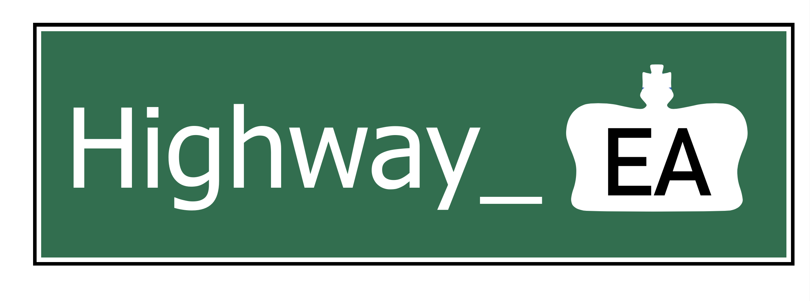
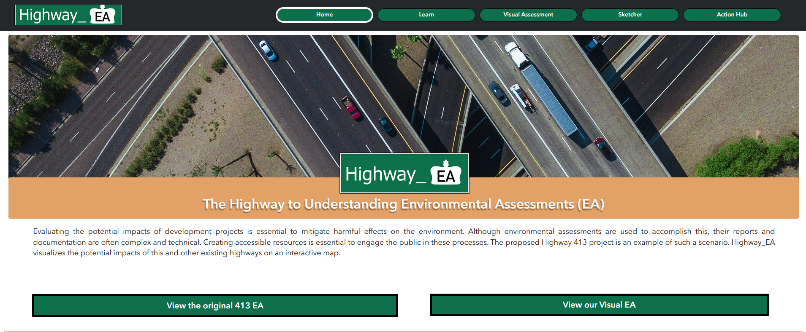
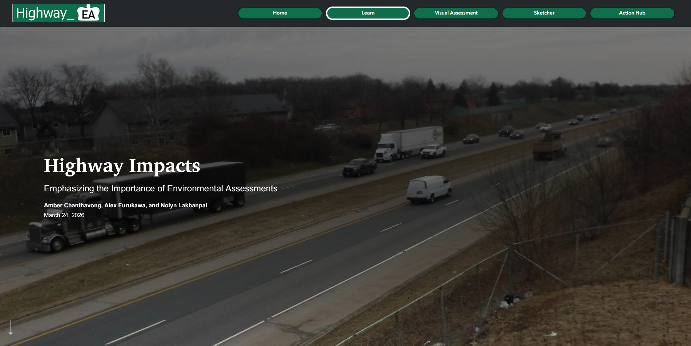
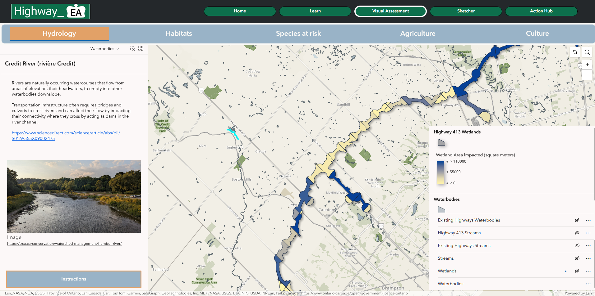
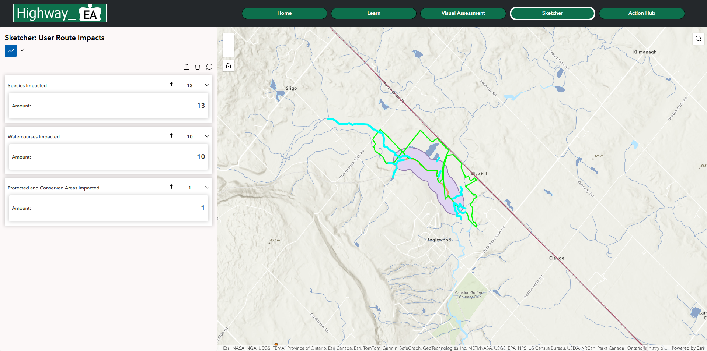
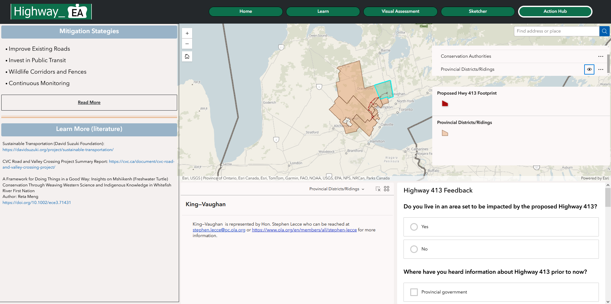
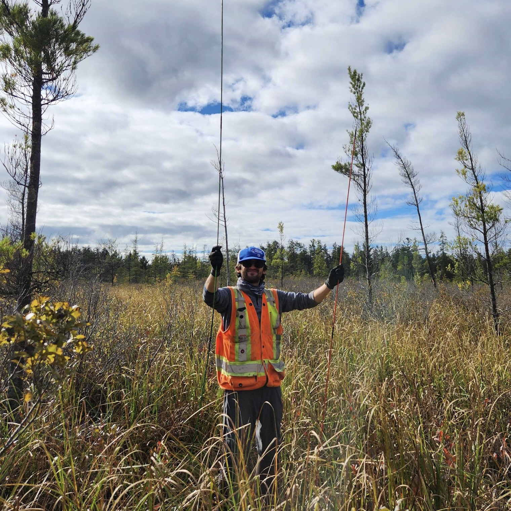

# Highway_EA: the highway to understanding Environmental Assessments

## Link to App
https://experience.arcgis.com/experience/a0214e05532e432080435caa8d889e07

## Mission Statement
As the population of the Greater Golden Horseshoe in Southern Ontario grows, transportation has become increasingly important. The combination of Ontario’s population growing at a rate of 3.1% in 2023 and a significant commuter culture has led to pressure to expand transportation infrastructure in the region. In response, Highway 413 was proposed to better connect major urban centres, alleviate anticipated traffic congestion, and reduce commuting time.

For this project, an Environmental Assessment (EA) was done. EAs involve collaboration among developers, government agencies, Indigenous communities, and the public to ensure that concerns are addressed, and mitigation measures are identified. However, EIAs are typically lengthy and technical, making them inaccessible to the public. In the case of Highway 413, public concern about the project lacks detail because of insufficient conceptualization and understanding.

Our team’s mission is to make the information presented in the EA for Highway 413 accessible to the public by using publicly available data to create a visual, non-technical app that allows the user to explore the different areas and components that would be impacted. Going further we aim to apply this framework to existing highways to evaluate the impact they have had, and apply it to other future projects. We aim to illustrate the physical impact that transportation projects such as these have on the landscape and ecosystems in Ontario, and to inform people about the legitimate concerns and why they matter. 

To summarize, our mission is to (1) demonstrate the impact of major highways in the context of long term sustainability, and (2) make Environmental Assessments more accessible to all Ontarians. Additionally, we look to present possible solutions, mitigations and middle grounds that acknowledge the necessity for both transport infrastructure and environmental sustainability in Ontario.The end goal is to give people the tools to understand EAs for large transportation infrastructure projects and the knowledge to inform and affect policy.

## Statement of Characteristics 
Highway_EA is an app designed to objectively present information that would otherwise be presented in long and technical documents. The app focuses specifically on the Environmental Assessment (EA) for large transportation infrastructure in Southern Ontario, with an emphasis on the proposed Highway 413. Making information communicated in an EA accessible is key in ensuring sustainable projects in Southern Ontario. The app accomplishes this goal in the following ways:

(1) The app presents a storymap of Highway Impacts, outlining the drawbacks in long-term sustainability and ecosystem diversity despite the need and benefits of such projects. Highway 413 is outlined, giving users the history, purpose and details about the project. This learn page is intended to give background and context to an unfamiliar user.

(2) The key component of the app is the Visual Assessment. This map allows users to view the key areas of impact around the project along with relevant statistics, summaries and information. The map outlines the three key impact categories assessed for in the EIA: Natural Environment, Social and Economic Development, and Cultural Environment.

(3) Highway_EA also allows the user flexibility to try out alternative transportation routes themselves with the Sketcher tool, where they can draw a highway or larger footprint and see roughly how much impact it might have.

(4) The app is concluded with a page called Action Hub. The purpose of this page is to provide users with actionable ways to advocate for and bring their concerns to the relevant channels; both governmental and through conservation authorities. 

## Methods

Our methods for spatial analysis are simple and adaptable for any kind of transportation instructure and different kinds of environmental and human features that may be impacted, using publicly available data from the Government of Ontario and Canada. For hydrological variables streams, waterbodies, wetlands and watersheds, features were considered impacted if within 200 m of highways. A 120 m proximity was used to evaluate impact to the primarily terrestrial features of protected areas, tracked species, natural heritage areas, and agricultural areas.

## User Guide

### Home

At the home page of Highway_EA you are introduced to the impetus behind the app, the proposed Highway 413 which can be investigated immediately via the original Environmental Assessment or jump immediately to our Visual Assessment tool. Familiarize yourself with our mission statement and a short video that introduces you to the topic of environmental impacts of highways and offers a tutorial for navigating the app.

### Learn

Scroll through Highway Impacts to get some background on Environmental Assessments, why they are done, and the potential impacts of urban development such as road construction on habitats and our water. Alternatives to mitigate the impact of transportation infrastructure are also introduced.

### Visual Assessment

In our Visual Assessment tool, you have five options with which to view potential impacts of Highway 413 and where they fall in the context of other highways in the Greater Golden Horseshoe (GGH) region of Ontario: Hydrology, Habitats. Species at risk, Agriculture and Culture. A pop-up window greets you with a visual guide to navigation each module.

In the Hydrology module you can view the impact (within 200 m) on wetlands, streams and waterbodies from the proposed Highway 413 footprint and other GGH highways. Click on road segments to see exactly how much area (or length) is impacted and the number of unique features. Continue down to toggle on each of the Hydrology features to learn more about different types of wetlands, streams and waterbodies and what the literature says about potential road impacts on them.

In the Habitats module, you may view the area of impact (120 m) that the proposed Highway 413 and existing GGH highways have on critical habitat to federally designated species at risk, and lands designated as protected areas such as conservation areas and provincial parks. Toggle on Critical Habitats and choose from the dropdown menu ‘Species common name is’ to view only the habitat of a species of interest and click on one of its habitats to learn more about the species, its protection status and its habitat. Toggle on the Protected Areas and click on different areas to learn more about them.

In the Species module, go beyond threatened species to explore the number of Provincially Tracked Species that are impacted by the proposed Highway 413 and existing GGH highways. This grid system of observed presences of this more extensive number of species can also be viewed to look for hotspots of biodiversity.

In the Agriculture module, one of the more direct impacts of roads and urbanization can be explored through the loss of fertile farmland, or Prime Agricultural Area impacted within 120 m of highways. Click on any plot of land to learn about what this means and what the literature has to say about this growing issue in North America.

Lastly in the Culture module, we present natural heritage areas that are important to our well-being such as the Greenbelt. The area impacted by the proposed Highway 413 and existing highways can be viewed along with the specific legislation behind these areas. We also provide two watersheds that face major impacts from the proposed highway, the Credit and Humber River watersheds that are significant to local communities and First Nations.

### Sketcher

With the Sketcher, you can try your hand at plotting out alternative highway routes, or other areas for future infrastructure. You can choose to draw a line or polygon, and this tool with automatically calculate the number of features it will cross, or impact, ranging from streams and water bodies to tracked species and protected areas. Do your best to draw the most sustainable path\!

### Action Hub

Now that you have explored Highway 413 and the environmental impacts of highway construction overall, you have the option to learn more, though possible solutions to these problems and links to more literature. Navigate to where your area if you are concerned and click on your jurisdiction for links to your local conservation authority and provincial representative to get involved, ask questions or get your voice heard. Please fill out our brief survey so that we can continue to learn more as well about individuals’ concerns.

## Data

| Title | Description/Notes | Format | Link | Available on ArcGIS Online? |
| :---- | :---- | :---- | :---- | :---- |
| Highway 413 Shape File | Link to a website with a highway 413 shapefile | Website, Shapefile | [https://highway413.ca/en/](https://highway413.ca/en/) | No |
| Provincially tracked species (1km grid) | Present absence species data Cells size is adequate  1811 species (count by scientific name) There’s a shapefile with 1km2 grids and a detail table. Join by Ogf Id (grids) and Prov Trk Species 1km Grid Id (detail) fields Detail table states Cosewic status Records from 2017 to 2025 | Shapefile | [https://data.ontario.ca/en/dataset/provincially-tracked-species-1km-grid/resource/53db4968-0c44-48e2-8862-851512451b8b](https://data.ontario.ca/en/dataset/provincially-tracked-species-1km-grid/resource/53db4968-0c44-48e2-8862-851512451b8b) | Yes |
| Ontario Hydro Network (OHN) Waterbody | Waterbodies in Ontario, polygon features (natural and constructed) that describe various realizations of surface water at a medium scale.  | Feature Class (polygon) | [https://hub.arcgis.com/datasets/22bab3c9f37a4dd0845eb89e7b247a9f\_25/about](https://hub.arcgis.com/datasets/22bab3c9f37a4dd0845eb89e7b247a9f_25/about)  | Yes |
| Ontario Hydro Network (OHN) Watercourses | Shows the location of watercourses in Ontario as part of the Ontario Hydro Network (OHN). Watercourses are line features – natural or manmade – that represent the location of flowing surface water.  | Feature Class (lines) | [https://geohub.lio.gov.on.ca/datasets/mnrf::ontario-hydro-network-ohn-watercourse/about](https://geohub.lio.gov.on.ca/datasets/mnrf::ontario-hydro-network-ohn-watercourse/about)  | Yes |
| Ontario Watershed Boundaries (OWB) | The Ontario Watershed Boundaries (OWB) collection represents the authoritative watershed boundaries for Ontario. Primary to quaternary | Feature Class (polygons) | [https://geohub.lio.gov.on.ca/maps/mnrf::ontario-watershed-boundaries-owb/about](https://geohub.lio.gov.on.ca/maps/mnrf::ontario-watershed-boundaries-owb/about)  | Yes |
| Canadian National Wetland Inventory | The Canadian National Wetlands Inventory (CNWI) is a comprehensive, publicly available national geodatabase that maps wetlands across Canada. It brings together the best available wetland data in a standardized format verified for consistency, reliability, and accuracy. | Feature Class (polygon) | [https://www.canada.ca/en/environment-climate-change/services/wildlife-habitat/canadian-national-wetland-inventory.html](https://www.canada.ca/en/environment-climate-change/services/wildlife-habitat/canadian-national-wetland-inventory.html)  | Yes |
| Ontario Road Network (ORN) | Road element or composite of roads in Ontario. | Feature Class (lines) | [https://geohub.lio.gov.on.ca/datasets/mnrf::ontario-road-network-orn-road-net-element/about](https://geohub.lio.gov.on.ca/datasets/mnrf::ontario-road-network-orn-road-net-element/about)  [https://data.ontario.ca/dataset/ontario-road-network-orn-composite](https://data.ontario.ca/dataset/ontario-road-network-orn-composite)  | Yes |
| Critical Habitat for Species at Risk National Dataset \- Canada | This dataset displays the geographic areas within which critical habitat (CH) for terrestrial species at risk, listed on Schedule 1 of the federal Species at Risk Act (SARA), occurs in Canada. Note that this includes only terrestrial species and species for which Environment and Climate Change Canada (ECCC) and Parks Canada Agency (PCA) lead. | Feature Class (line)| [https://open.canada.ca/data/en/dataset/47caa405-be2b-4e9e-8f53-c478ade2ca74](https://open.canada.ca/data/en/dataset/47caa405-be2b-4e9e-8f53-c478ade2ca74)  | Yes |
| Conservation Authority Administrative Area  | Conservation Authority Administrative Areas are lands under the jurisdiction of a Conservation Authority. Note not complete coverage. Additional possible useful data: [https://co-opendata-camaps.hub.arcgis.com/](https://co-opendata-camaps.hub.arcgis.com/)  | Feature Class (polygon) | [https://geohub.lio.gov.on.ca/datasets/lio::conservation-authority-administrative-area/about](https://geohub.lio.gov.on.ca/datasets/lio::conservation-authority-administrative-area/about)  | Yes |
| Canadian Protected and Conserved Areas Database | The Canadian Protected and Conserved Areas Database (CPCAD) is the authoritative source of data on protected and conserved areas in Canada. | Feature Class (polygons) | [https://open.canada.ca/data/en/dataset/6c343726-1e92-451a-876a-76e17d398a1c](https://open.canada.ca/data/en/dataset/6c343726-1e92-451a-876a-76e17d398a1c)  | Yes |
| Ontario Electoral Districts | Shape files provide geometry of the boundaries for each electoral district in Ontario and can be used for GIS (geographic information system) applications. They are available to download. | Shapefiles (polygon) | [https://www.elections.on.ca/en/voting-in-ontario/electoral-district-shapefiles.html](https://www.elections.on.ca/en/voting-in-ontario/electoral-district-shapefiles.html)  | No |
| Greater Golden Horseshoe  | The built boundary identifies built-up urban areas across the Greater Golden Horseshoe. | Feature Class (polygon) | [https://www.arcgis.com/home/item.html?id=25ba6fb6b7894be0b684dd28c07a3bf9](https://www.arcgis.com/home/item.html?id=25ba6fb6b7894be0b684dd28c07a3bf9)  | Yes |
| OMAFRA Agricultural Land Base Greater Golden Horseshoe | The agricultural land base for the Greater Golden Horseshoe is comprised of prime agricultural areas, including specialty crop areas, and rural lands that together create a continuous, productive land base for agriculture. The Province has issued the agricultural land base map as enabled by the Greenbelt Plan, 2017; the Growth Plan, 2017; the Oak Ridges Moraine Conservation Plan, 2017; and the Niagara Escarpment Plan, 2017 | Feature Class (polygon) | [https://www.arcgis.com/home/item.html?id=dcd2ec8a0da34f3fae280103a46b6a63](https://www.arcgis.com/home/item.html?id=dcd2ec8a0da34f3fae280103a46b6a63)  | Yes |
| Natural Heritage System Area | Systems of natural core areas and key natural corridors or linkages, such as rivers and valleys, with significant ecological value for use in land use planning. | Feature Class (polygon) | [https://geohub.lio.gov.on.ca/datasets/lio::natural-heritage-system-area/about](https://geohub.lio.gov.on.ca/datasets/lio::natural-heritage-system-area/about)  | Yes |

## References

Anciaes, P., Cheng, Y., & Watkins, S. J. (2025). Policy measures to reduce road congestion: What worked? Journal of Transport & Health, 41, 101984. https://doi.org/10.1016/j.jth.2025.101984

Blanton, P., & Marcus, W. A. (2009). Railroads, roads and lateral disconnection in the river landscapes of the continental United States. Geomorphology, 112(3-4), 212-227.

Choquette, J. D., & Valliant, L. (2016). Road Mortality of Reptiles and Other Wildlife at the Ojibway Prairie Complex and Greater Park Ecosystem in Southern Ontario. The Canadian Field-Naturalist, 130(1), 64. https://doi.org/10.22621/cfn.v130i1.1804

Cole, J. R., Koen, E. L., Pedersen, E. J., Gallo, J. A., Kross, A., & Jaeger, J. A. G. (2023). Impacts of anthropogenic land transformation on species-specific habitat amount, fragmentation, and connectivity in the Adirondack-to-Laurentians (A2L) transboundary wildlife linkage between 2000 and 2015: Implications for conservation and ecological restoration. Landscape Ecology, 38(10), 2591–2621. https://doi.org/10.1007/s10980-023-01727-6

DeCatanzaro, R., Cvetkovic, M., & Chow-Fraser, P. (2009). The relative importance of road density and physical watershed features in determining coastal marsh water quality in Georgian Bay. Environmental Management, 44(3), 456-467.

Dixon, H. J., Elmarsafy, M., Hannan, N., Gao, V., Wright, C., Khan, L., & Gray, D. K. (2022). The effects of roadways on lakes and ponds: a systematic review and assessment of knowledge gaps. Environmental Reviews, 30(4), 501-523.

Earon, R., Olofsson, B., & Renman, G. (2012). Initial effects of a new highway section on soil and groundwater. Water, Air, & Soil Pollution, 223(8), 5413-5432.

Elmes, M. C., Petrone, R. M., Volik, O., & Price, J. S. (2022). Changes to the hydrology of a boreal fen following the placement of an access road and below ground pipeline. Journal of Hydrology: Regional Studies, 40, 101031.

Environmental Defence. (2022). Stop the 413. Environmental Defence. https://environmentaldefence.ca/stop-the-413-3/

Eyles, N., & Meriano, M. (2010). Road-impacted sediment and water in a Lake Ontario watershed and lagoon, City of Pickering, Ontario, Canada: An example of urban basin analysis. Sedimentary Geology, 224(1-4), 15-28. 

T Findlay, C. S., & Bourdages, J. (2000). Response time of wetland biodiversity to road construction on adjacent lands. Conservation Biology, 14(1), 86-94.

Francis, C. A., Hansen, T. E., Fox, A. A., Hesje, P. J., Nelson, H. E., Lawseth, A. E., & English, A. (2012). Farmland conversion to non-agricultural uses in the US and Canada: Current impacts and concerns for the future. International Journal of Agricultural Sustainability, 10(1), 8-24.

Gray, T. (2026, March 18). Ontario wants to build Highway 413 without completing a proper environmental review - Environmental Defence. Environmental Defence. https://environmentaldefence.ca/2026/03/18/highway-413-no-proper-environmental-assessment/

Huang, C. P., & Ehrlich, R. S. (2003). Erosion control and the impact of highway construction on wetland water quality: A case study. In Watershed Management (pp. 117-138).

Humber River, Ontario | Canadian Heritage Rivers System. (n.d.). Canadian Heritage Rivers System. https://chrs.ca/en/rivers/humber-river

Krupík, P. (2025). The Impact of Road Infrastructure Development on Selected Environmental, Economic, and Social Indicators. Civil and Environmental Engineering, 22(1). https://doi.org/10.2478/cee-2026-0022

McGuire, T., & Morrall, J. F. (2000). Strategic highway improvements to minimize environmental impacts within the Canadian Rocky Mountain National Parks. Canadian Journal of Civil Engineering, 27(3), 523–532. https://doi.org/10.1139/l99-096

Meriano, M., Eyles, N., & Howard, K. W. (2009). Hydrogeological impacts of road salt from Canada's busiest highway on a Lake Ontario watershed (Frenchman's Bay) and lagoon, City of Pickering. Journal of contaminant hydrology, 107(1-2), 66-81.

National Oceanic and Atmospheric Administration. (2024, June 16). What is a Watershed? National Ocean and Atmospheric Administration. https://oceanservice.noaa.gov/facts/watershed.html

Ontario Ministry of Transportation. (2026). Highway 413 Final Environmental Impact Assessment Report. https://highway413.ca/en/wp-content/uploads/2026/03/Highway-413-Final-EIAR_web-version_Mar2026.pdf

Our Watershed. (n.d.). Credit Valley Conservation. https://cvc.ca/our-watershed/

Roe, J. H., Gibson, J., & Kingsbury, B. A. (2006). Beyond the wetland border: estimating the impact of roads for two species of water snakes. Biological Conservation, 130(2), 161-168.

Saraswati, S., Bhusal, Y., Trant, A. J., & Strack, M. (2020). Roads impact tree and shrub productivity in adjacent boreal peatlands. Forests, 11(5), 594.

Wheeler, A. P., Angermeier, P. L., & Rosenberger, A. E. (2005). Impacts of New Highways and Subsequent Landscape Urbanization on Stream Habitat and Biota. Reviews in Fisheries Science, 13(3), 141–164. https://doi.org/10.1080/10641260590964449

Ontario Ministry of Finance. (2024). Ontario's Long-Term Report on the Economy
https://www.ontario.ca/document/ontarios-long-term-report-economy-2024/chapter-1-demographic-trends-and-projections-2024#c1-2

Stock footage and photos courtesy of https://www.pexels.com/ and https://unsplash.com/. Music from https://pixabay.com.

## Team MACorridors

### Amber

Hello! I am a fourth-year student in the Honours Biodiversity and Environmental Sciences program pursuing an Interdisciplinary Minor in Archaeology and a Concurrent Certificate in GIS. Throughout my undergraduate career, I have developed a diverse skill set in geomatics and gained valuable field experience in completing various independent projects. My current research involves using high-resolution satellite imagery to detect changes in vegetative functional groups between contrasting water-level scenarios in the coastal marshes of Georgian Bay. Beyond academics, I enjoy taking long walks while listening to music (I’m very fond of Mitski) and spending time with my kitten, Ellie.

### Alex 

I am a Ph.D candidate of Earth and Environmental Sciences in the Mac Ecohydrology Lab and an ECCE student associate. My research explores the hydrological dynamics of the peatlands of the Boreal Shield and how that influences their resilience to climate change and wildfire. I’ve been a long-time teaching assistant for GIS at McMaster since my M.Sc and integrate it into my field-based research wherever I can. When I’m not in the outdoors for science reasons I also love hiking and fishing, though not typically in peatlands.

### Nolyn 

I am currently in my fourth year of the Honours Environment and Society program at McMaster University, where I am also completing a concurrent Certificate in Geographic Information Systems (GIS) and a Minor in Philosophy. This year, I had the privilege of chairing the National Geomatics Competition (NGC), helping bring the competition to McMaster for the first time in its history. During my undergraduate studies, I have also been a teaching assistant for McMaster’s introductory GIS course and done research using raster suitability analysis.
