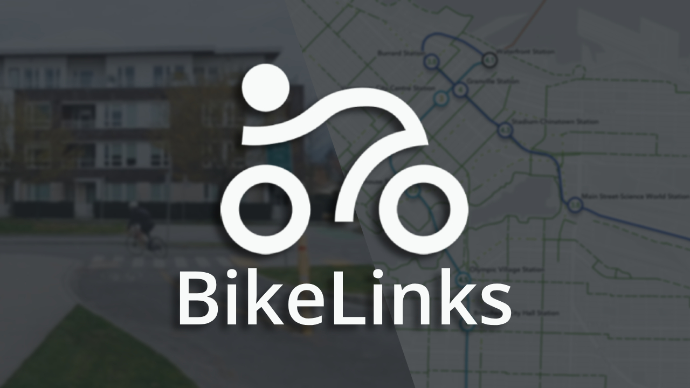
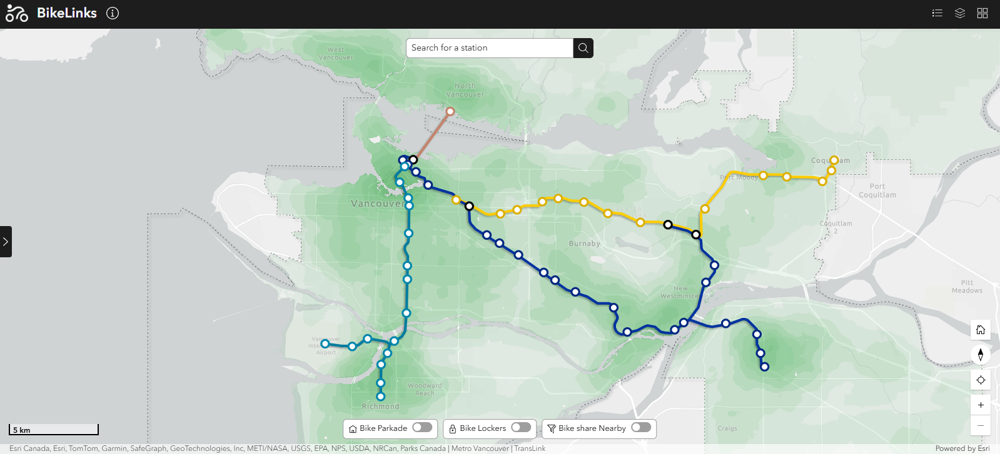
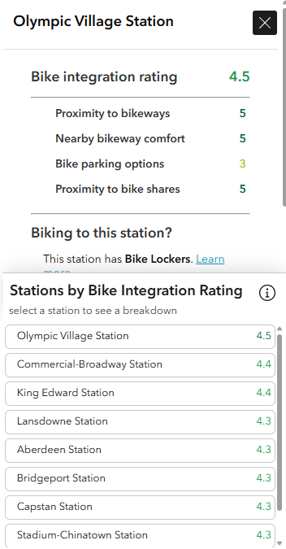
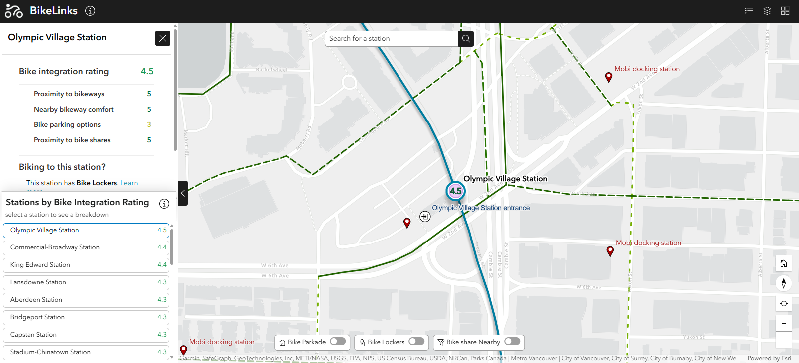

# BikeLinks

## Examining Bike-Transit Integration in Metro Vancouver
BikeLinks is an Experience Builder web app created by Jon Atienza, Brendan Kelly, and Ethan Lo for the ECCE App Challenge 2026.
## Team Pedal to the Metal
- Jon Atienza
- Brendan Kelly
- Ethan Lo

# Mission Statement

The City of Surrey’s Climate Change Action Strategy states that “the science is unequivocal, excess greenhouse gases from human activities are driving warming of the atmosphere, oceans and land, resulting in widespread disturbances to both natural and human systems” (1). To begin to tackle such a complex and global issue, Surrey and other municipalities around Metro Vancouver have developed their own plans and objectives for tackling climate change. One key theme that links these cities’ plans is one of the pillars of sustainability in urban areas, transportation, more specifically, active and public transportation. For example, a key target for the city of Vancouver is to ensure that two thirds of all trips are made by walking, cycling and public transit by 2040 (2).

However, “while \[active transportation like\] cycling is growing in popularity, many people are discouraged from riding because it seems dangerous or impractical. There are many challenges, including a lack of direct routes, finding convenient and secure parking, weather, and topography, but the biggest concern for most people is motor vehicle traffic” (3). This tension between the existing status-quo of car-dependency and a burgeoning cycling and mass transit commuter culture is the main limiting factor that prevents Metro Vancouver from becoming more sustainable. In other words, for cities to truly meet their sustainability goals, the cycling and transit infrastructure must be in place to meet such burgeoning demand. One often overlooked aspect in the development of this infrastructure is the connection between cycling and transit.

BikeLinks seeks to unite cycling and transit infrastructure in one app. We feel that the lack of information about multi-modal transportation serves as a bottleneck that limits Metro Vancouver’s ability to have truly sustainable transit. Resources exist for both cycling and transit but a harmonious, detailed and interactive resource that informs the public about the connection of these two systems does not. We aim to bridge the gap between these two worlds so that biking and transit in tandem can become a core component in the lives of many more Metro Vancouver citizens.

# Statement of Characteristics

BikeLinks was created to fill a gap in readily available information regarding bike-transit commuting in Metro Vancouver. It provides detailed information for each SkyTrain and SeaBus station in the TransLink network, including a bike integration rating, which was created to critically observe the quality of bike-transit integration at each station on a scale of one to five. This bike integration rating is calculated using four unique criteria, specifically selected to reward the ease of and options available for transitioning from transit to biking or biking to transit at each SkyTrain station. 

As a user, BikeLinks ultimately acts as a decision support tool, providing a unified resource to aid commuters choose the best stations for a seamless travel experience across Metro Vancouver. With our app, we hope to encourage more transit users to incorporate bikes, and cyclists to incorporate transit into their journeys. Simultaneously, the app also serves as a platform to encourage TransLink and Metro Vancouver municipalities to provide better integration between cycling and transit in the region.

# Methodology

## Bike Integration Rating

Provides a combined measure of a transit station’s integration with cycling infrastructure. Using a weighted combination of all four individual station ratings, this rating assigns higher scores to those stations which provide a more seamless connection between biking and transit.

| Rating Criteria | Importance | Weight |
| :---- | :---- | :---- |
| Proximity to bikeways | Most important | 0.35 |
| Nearby bikeway comfort | High | 0.25 |
| Bike parking options | High | 0.25 |
| Proximity to Bike Shares | Low importance | 0.15 |

Criteria weights for the combined bike integration rating were determined by first assuming equal weight of 0.25 to all four factors. We then chose the two factors that we felt were the least and most important. Taking a weight of 0.1 from the least important and placing it on the most important to complete a basic criteria weighting system. Proximity to bike shares was chosen to be the least important because current bike sharing programs in Metro Vancouver are inconsistent, disconnected, and overpriced, as proven by the very recent passing of  a City of Vancouver motion to strive for a “cheap, easy, and everywhere” bike share system (4). In addition, proximity to cycleways was chosen to be the criteria of the utmost importance because we believe that a short, seamless connection from a station to bikeways should be duly rewarded over bike parking, or bikeway comfortability, both of which are secondary factors.

## Proximity to Bikeways

Provides a measure of a station's proximity to the nearby bike network. Higher scores reward stations that make it seamless to connect to bikeways.

| Rating | Description | Distance to Nearest Bikeway |
| :---- | :---- | :---- |
| 5 | Connecting to the bike network is seamless | \< 50m |
| 4 | Connecting to the bike network is quite easy | \< 150m |
| 3 | Connecting to the bike network is easy  | \< 250m |
| 2 | Connecting to the bike network is possible | \< 350m |
| 1 | Connecting to the bike network is difficult | \>= 350m |

We designed a 1-5 rating based on the distance of the nearest cycleway from a SkyTrain station. We chose the distance 50 metres as a 5 star rating because at that range, it represents an instant transition from transit to biking, furthermore, past 350m, bikeways become a challenge to connect to.

## Nearby Bikeway Comfort

Provides a measure of bike riding comfort for bikeways near to a station. Higher scores reward stations that are located near safe and accessible bike networks.

| Rating | Description | Highest comfort rating of bikeways within 350m | Highest comfort rating of bikeways within 250m |
| :---- | :---- | :---- | :---- |
| 5 | Bikeways that are comfortable for most people are very close by | N/A | 3 |
| 4 | Bikeways that are comfortable for most people are close by | 3 | N/A |
| 3 | Bikeways that are comfortable for most some are close by | 2 | N/A |
| 2 | Bikeways that are comfortable for most few people are close by | 1 | N/A |
| 1 | No bikeways are close by | N/A | N/A |

#### Bikeway Comfort Rating

Bikeway comfortability is based on the Can-BICS classification system (4). This table was used to classify bikeways based on a comfortability rating which is then used to aid the scoring for the ‘Nearby Bikeway Comfort’ criteria.

| Rating | Bikeway Comfortability | Description | Bikeway Category |
| :---- | :---- | :---- | :---- |
| 3 | High | Comfortable for most people | Local Street Bikeway, Cycle Track, Bike Path |
| 2 | Medium | Comfortable for some people | Multi-use Path |
| 1 | Low | Comfortable for few people | Painted Bike Lane, Major Shared Roadway |

## Bike Parking Options

Provides a measure of how well-equipped a station is to support both long, and short-term bike storage. Higher scores reward stations that provide multiple secure options for bike storage.

| Rating | Description | Bike Parking Facilities |
| :---- | :---- | :---- |
| 5 | Provides ample secure bike parking facilities | Parkade, Lockers and Racks |
| 4 | Provides secure bike parking facilities | Parkade and Racks |
| 3 | Provides quite secure bike parking facilities | Lockers and Racks |
| 2 | Provides insecure bike parking facilities | Racks only |
| 1 | Provides no bike parking facilities | None |

For this rating, we prioritized facilities such as indoor bike parkades and bike lockers over standard outdoor bike racks as they mitigate issues such as theft and exposure. Furthermore, as bike parkades and lockers serve slightly different purposes, having both was considered ideal.

## Proximity to Bike Shares

Provides a measure of a station's proximity to nearby bike share stations. Higher scores reward stations that have bike shares within a short distance, within view of the station being ideal.

| Rating | Description | Distance to Nearest Bike Share Station |
| :---- | :---- | :---- |
| 5 | Accessing bike share is very easy | \< 50m |
| 4 | Accessing bike share is easy | \< 150m |
| 3 | Accessing bike share is doable | \< 250m |
| 2 | Accessing bike share is difficult | \< 350m |
| 1 | Accessing bike share is nearly impossible | >= 350m |

# Limitations

## Bike Integration Rating

One key limitation of the BikeLinks app is the selection of factors for the calculation of our bike integration rating. Due to time and data constraints, some factors are more robust than others. Furthermore, datasets that may have made our rating a stronger measure either are not publically available or could not be processed within the project timeline. In addition, the rating for each variable and the weighting of each criteria for final combined rating introduces a degree of subjectivity. For example, different commuters may prioritize bike infrastructure over proximity to bike networks, which will result in a different overall rating. In summary, we recognize that the resulting bike integration ratings and rankings are subject to our own personal biases

## Bikeways Data

Another limitation is the inconsistency of publicly available bikeways data across the municipalities in the Metro Vancouver region. Since our analysis required some consolidation of datasets from multiple sources, some bikeway networks may be missing or categorized with less precision than in areas with robust datasets. Thus, proximity and comfort scores and bike network density in some areas are best effort approximations and subject to inherent data reporting bias.

## Bike Share Location Data

We understand that some municipalities have been recently rolling out bike share programs in recent months, however, data for the stations in these systems is not yet publicly available and therefore cannot be considered for this rating. For this reason, this data is subject to a bias towards those municipalities that have bike sharing services which serve publicly accessible data, something that all should strive for.

# User Guide

## The Default View

1. Explore the Map  
    - Upon opening the app, the default view layers Metro Vancouver’s Skytrain Stations and transit lines over the density of the regional bike network. 
    - Dark green regions indicate high-density cycling infrastructure, while light green regions highlight sparse network areas.

2. Select Your Station
    - Find your starting point or destination using one of three methods:

        1. **Search**: Use the search bar at the top to find a specific station  
        2. **Select**: Click any station directly on the map  
        3. **Locate**: Tap the ‘Find my Location’ button in the bottom right corner

3. Customize Your View  
    - Use the filters at the bottom of the map to refine your results and view only the stations that meet your commuting needs.

## Information Panel

1. Bike Integration Rating  
    - At the top of the information panel, you can view the station’s bike integration rating based on our weighted scoring system. 
    - Explore our methodology to find out more about the data behind the score.

2. Ranked List  
    - Here, you will find a ranked list of all stations, allowing you to see how your selection ranks. 
    - It also serves as a quick reference for comparing bike integration across all the stations.

## Close-up View

1. Identify Key Infrastructure

    * Bike Share Stations  
    * SkyTrain Station Entrances  
    * Local Bike Network

2. Simple Visualization  
    - This perspective makes it easy to visualize infrastructure arms of each chosen SkyTrain station. 
    - To assist with planning your trip, bike paths are symbolized based on the type of bike path, generally, darker and more solid features are considered more comfortable for cyclists.

## Header

1. Tabs for Customizability  
    - Includes legend, map layers and a basemap gallery to customize your map experience. 

2. Website and Information (i) Icon  
    - Click on our logo to access the home page of our website. 
    - Click on the information (i) icon to head straight to the about page where you can learn more about the data behind our rating and our methodology

# Sources

## Datasets

| Layer name | Description | Data Type | Data Source(s) |
| :---- | :---- | :---- | :---- |
| Stations | Point locations of SkyTrain and SeaBus stations | Point | [Translink GTFS Static Data](https://www.translink.ca/about-us/doing-business-with-translink/app-developer-resources/gtfs/gtfs-data) |
| Transit Lines | Line features representing SkyTrain and SeaBus lines | Polyline | [Translink GTFS Static Data](https://www.translink.ca/about-us/doing-business-with-translink/app-developer-resources/gtfs/gtfs-data) |
| Bike accessible entrances | Point locations of SkyTrain and SeaBus station entrances with elevators | Point | [Translink GTFS Static Data](https://www.translink.ca/about-us/doing-business-with-translink/app-developer-resources/gtfs/gtfs-data) |
| Bike share locations | Point locations of bike share drop-off and docking stations | Point | [OpenStreetMap](https://overpass-turbo.eu/s/2mKd) |
| Bikeways | Line features of bikeways from many sources, reclassified for consistent naming. | Polyline | [City of Vancouver](https://opendata.vancouver.ca/explore/dataset/bikeways/information/?disjunctive.year_of_construction&disjunctive.bike_route_name&disjunctive.bikeway_type&disjunctive.subtype&sort=bike_route_name) \+ [City of Burnaby](https://data.burnaby.ca/datasets/a67af76a2e834288be38c5c8f7bbbd93_14/explore?location=49.238000%2C-122.959000%2C12) \+ [City of Burnaby](https://data.burnaby.ca/datasets/burnaby::bike-trails/explore?location=49.237800%2C-122.958300%2C12) \+ [City of Surrey](https://opendata-surrey.hub.arcgis.com/search?groupIds=38029c295cf54e84846c67849e0a7d19&q=bike) \+ [City of New Westminster](https://opendata.newwestcity.ca/datasets/trails-and-bikeways-4/explore) \+ [Statistics Canada](https://www150.statcan.gc.ca/n1/pub/23-26-0004/232600042024001-eng.htm) \+ [OpenStreetMap](https://overpass-turbo.eu/s/2n3p) |
| Bike network density | Simplified polygon layer of bikeway line density weighted by comfort level | Polygon | Created from the Bikeways layer|
| Data boundary | Polygon representing the boundary of bikeway data used | Polygon | [Metro Vancouver Open Data](https://open-data-portal-metrovancouver.hub.arcgis.com/datasets/1c86f57d9fcc4fc3a8134328b07f07e6_10/explore?location=49.285016%2C-123.061408%2C9) |

## Sources for Analysis

| Source | Purpose |
| :---- | :---- |
| [Hub Cycling Map](https://bikehub.ca/hub-cycling-map) | Reference for our bike integration weighted scoring system |
| [City of Burnaby Bike Trails Map](https://www.burnaby.ca/sites/default/files/acquiadam/2023-04/Bike-Map.pdf)  | To cross-reference and validate our bike network for City of Burnaby |
| [City of Richmond Trail Cycling Map](https://www.richmond.ca/__shared/assets/trailcyclingmap202472320.pdf) | To cross-reference and validate our bike network for City of Richmond |
| [The Canadian Bikeway Comfort and Safety (Can-BICS) Classification System](https://www.canada.ca/en/public-health/services/reports-publications/health-promotion-chronic-disease-prevention-canada-research-policy-practice/vol-40-no-9-2020/canbics-classification-system-naming-convention-cycling-infrastructure.html%20) | Reference for bike density layer and bike integration weighted scoring system |

## Video Sources

### Inspiration

[The Bike Share Dilemma – Uytae Lee](https://www.youtube.com/watch?v=qfz6AsYycA8)  
[Green Vancouver](https://vancouver.ca/green-vancouver.aspx)  
[Greenest City Action Plan – Vancouver](https://vancouver.ca/green-vancouver/greenest-city-action-plan.aspx)  
[Climate Emergency Action Plan – Vancouver](https://vancouver.ca/green-vancouver/vancouvers-climate-emergency.aspx)  
[Climate action through transportation – Vancouver](https://vancouver.ca/green-vancouver/transportation.aspx)  
[Transportation 2040 – Vancouver](https://vancouver.ca/streets-transportation/transportation-2040.aspx)  
[Environmental Sustainability Strategy – Burnaby](https://www.burnaby.ca/our-city/strategies-and-plans/environmental-sustainability-strategy)  
[Sustainability – Surrey](https://www.surrey.ca/about-surrey/sustainability)  
[Climate Change Action Strategy – Surrey](https://www.surrey.ca/about-surrey/sustainability/climate-change-action-strategy)  
[CleanBC](https://cleanbc.gov.bc.ca/)

### Images

Sustainability: [Noah Buscher](https://unsplash.com/photos/green-plant-x8ZStukS2PM)  
Greenhouse gases: [Marcin Jozwiak](https://unsplash.com/photos/white-smoke-coming-out-from-building-uKvPDQop-JA)  
Climate change: [Matt Palmer](https://unsplash.com/photos/brown-and-green-grass-field-near-body-of-water-under-cloudy-sky-during-daytime-K5KmnZHv1Pg)  
City of Surrey: [Kharl Anthony Paica](https://unsplash.com/photos/a-very-tall-building-sitting-next-to-a-parking-lot-0ykNX2B6QFE)

### Music

[Whiskey Blues by SoundStreet](https://tunetank.com/track/6378-whiskey-blues/)

## Photo Sources

[https://www.pexels.com/photo/drone-shot-of-a-city-6943663/](https://www.pexels.com/photo/drone-shot-of-a-city-6943663/)  
[https://www.pexels.com/photo/abstract-black-and-white-ocean-surface-35102253/](https://www.pexels.com/photo/abstract-black-and-white-ocean-surface-35102253/)

## Research Sources

[(1) https://www.surrey.ca/about-surrey/sustainability/climate-change-action-strategy](https://www.surrey.ca/about-surrey/sustainability/climate-change-action-strategy)   
[(2) https://vancouver.ca/files/cov/greenest-city-2020-action-plan-2015-2020.pdf](https://vancouver.ca/files/cov/greenest-city-2020-action-plan-2015-2020.pdf)   
[(3) https://vancouver.ca/streets-transportation/transportation-2040.aspx](https://vancouver.ca/streets-transportation/transportation-2040.aspx)  
[(4) https://www.canada.ca/en/public-health/services/reports-publications/health-promotion-chronic-disease-prevention-canada-research-policy-practice/vol-40-no-9-2020/canbics-classification-system-naming-convention-cycling-infrastructure.html](https://www.canada.ca/en/public-health/services/reports-publications/health-promotion-chronic-disease-prevention-canada-research-policy-practice/vol-40-no-9-2020/canbics-classification-system-naming-convention-cycling-infrastructure.html)   
[(5) https://council.vancouver.ca/20260311/documents/cfsc\_motion3.pdf](https://council.vancouver.ca/20260311/documents/cfsc_motion3.pdf)