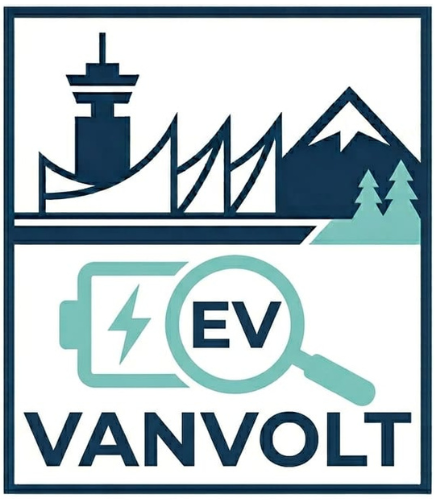
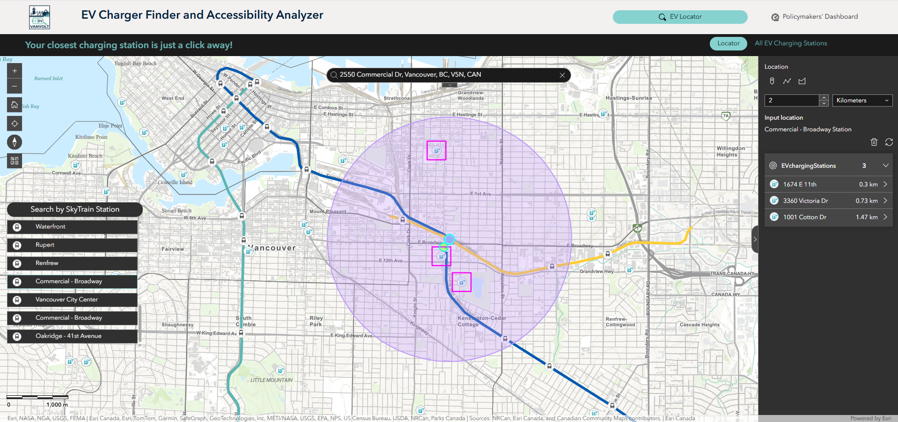
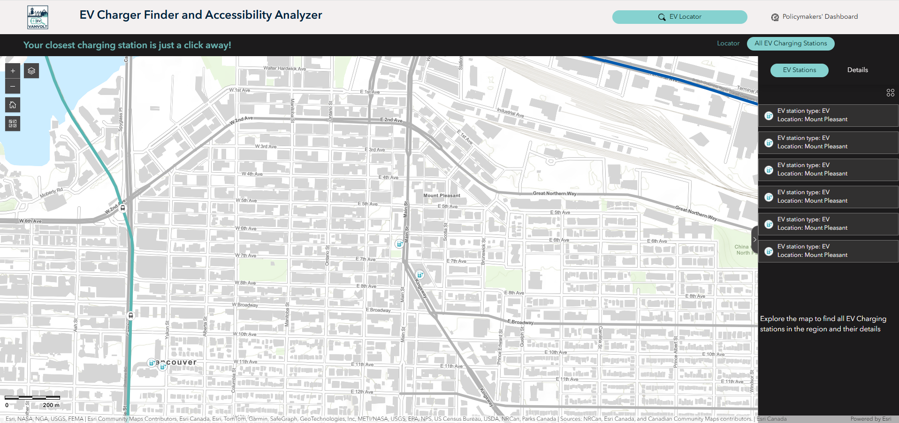
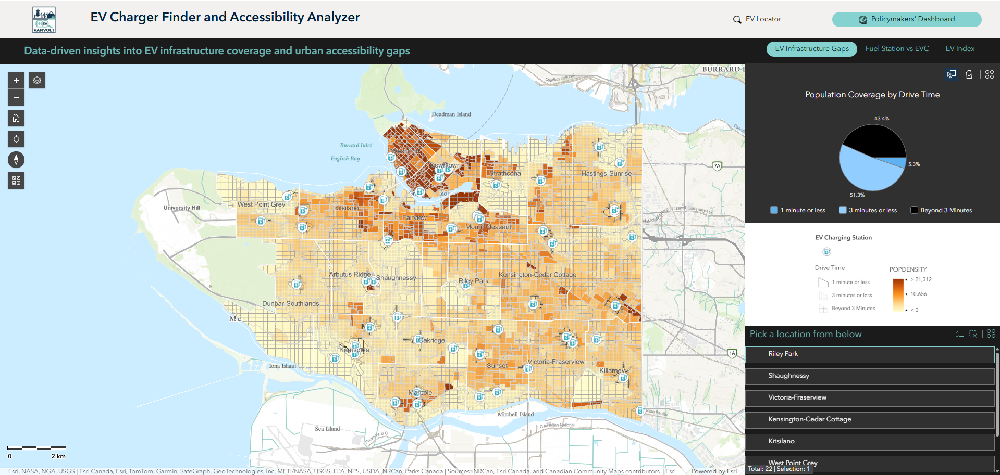
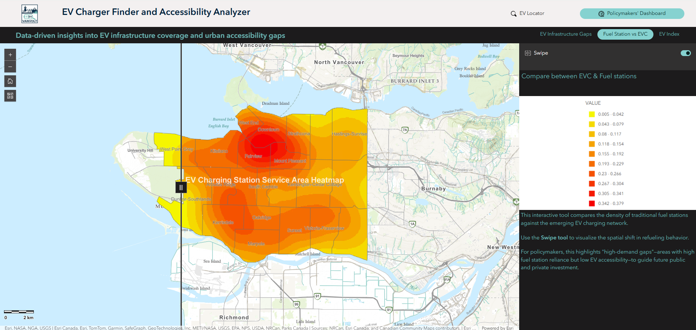
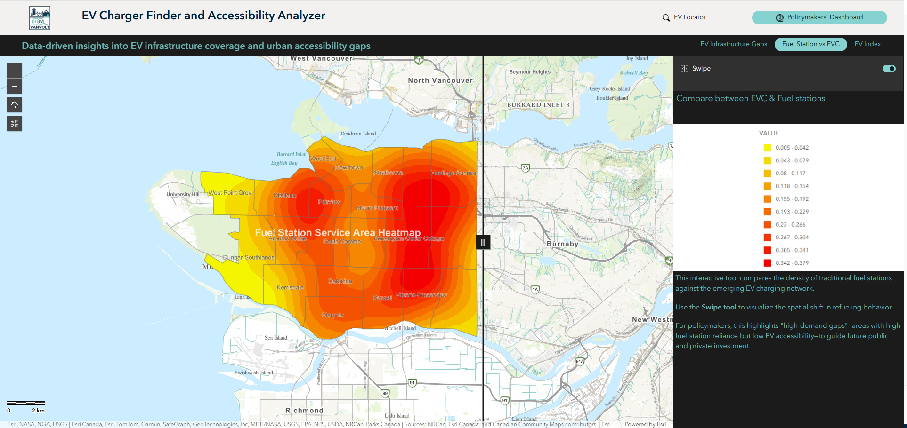
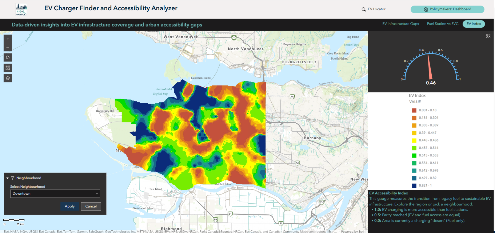

  

# VanVolt – EV Charger Finder & Accessibility Analyzer

  

## Team Members

- Esha Karim  
- Sreekanth Satheesh  
- Tim Kong

## Goal

VanVolt explores EV charging accessibility across the region and identifies infrastructure gaps compared to traditional fuel stations.

The app enables users to analyze spatial coverage, uncover underserved areas, and support sustainable transportation planning by promoting the adoption of zero-emission vehicles.

## How to Use the App

### EV Locator

#### 1. Locator

**Purpose**  
Find the nearest EV charging stations based on a selected location and customizable search distance.

**How to Use**
- Search for a location using the search bar (e.g., address or place), or select a SkyTrain station from the list.
- Alternatively, use the map tools (icons) to click directly on the map and set a location.
- Adjust the search distance and unit (e.g., kilometers) in the right panel.
- The app will display nearby EV charging stations within the selected range.

**What You’ll See**
- A buffer area representing the search distance.
- Highlighted EV charging stations within the buffer.
- A list of nearby stations with distance information.

**Insight**  
Quickly identify the closest charging options and evaluate accessibility around key transit locations or user-defined points.

#### 2. All EV Charging Stations

**Purpose**  
Explore all EV charging stations across the region and view detailed information for each location.

**How to Use**
- Navigate the map by zooming and panning to your area of interest.
- The **EV Stations** panel (right side) automatically updates to show stations within the current map view.
- Select a station from the list or directly from the map.
- Switch to the **Details** tab to view additional information such as address and operator.

**What You’ll See**
- EV charging station points across the map.
- A dynamically filtered list of stations based on the current map extent.
- Detailed station information including location and operator.

**Insight**  
Gain a quick overview of EV charging availability in any area and access key details to support location-based decision making.

### Policymakers’ Dashboard

#### 3. EV Infrastructure Gaps

**Purpose**  
Identify areas with limited EV charging accessibility based on population coverage and drive-time analysis.

**How to Use**
- Explore the map to view EV charging coverage across different areas.
- Use the drive-time categories (e.g., 1 minute, 3 minutes, beyond 3 minutes) to understand accessibility levels.
- Select a neighborhood from the list to zoom into a specific area.
- Refer to the chart on the right to see population coverage distribution by drive time.

**What You’ll See**
- A population density map overlaid with EV accessibility categories.
- Different visual patterns representing levels of access:
  - **1 minute or less** → high accessibility  
  - **3 minutes or less** → moderate accessibility  
  - **Beyond 3 minutes** → underserved areas  
- A summary chart showing the proportion of population within each accessibility level.

**Insight**  
Quickly identify underserved areas where EV infrastructure is lacking, helping support planning decisions for improving equitable access to charging stations.

#### 4. Fuel Station vs EVC

  
  

**Purpose**  
Compare the spatial coverage and density of traditional fuel stations versus EV charging stations.

**How to Use**
- Use the **Swipe tool** to compare between EV charging station coverage and fuel station coverage.
- Drag the vertical slider across the map to reveal differences between the two layers.
- Explore different areas to observe how coverage varies across the region.

**What You’ll See**
- Heatmaps representing service area density for:
  - EV charging stations  
  - Fuel stations  
- A swipe interface that allows side-by-side visual comparison.
- Color intensity indicating higher or lower service coverage.

**Insight**  
Identify areas where fuel station coverage is high but EV charging availability is limited, highlighting potential gaps for future EV infrastructure development.

#### 5. EV Index

**Purpose**  
Evaluate the balance between EV charging accessibility and traditional fuel station access using a combined index derived from accessibility and service coverage metrics.

**How to Use**
- Explore the map to view EV accessibility levels across the region.
- Use the **Neighbourhood filter** to focus on a specific area.
- Click **Apply** to update the map and index for the selected neighborhood.
- Refer to the gauge on the right to see the overall EV Index value.

**What You’ll See**
- A heatmap representing EV accessibility levels:
  - Higher values → better EV accessibility  
  - Lower values → reliance on fuel infrastructure  
- A gauge indicating the overall EV Index score.

**Insight**  
Understand how well EV infrastructure is keeping pace with traditional fuel access, and identify areas where investment is needed to support the transition to electric mobility.

The index integrates EV charger accessibility and fuel station availability to provide a comparative measure of infrastructure balance.

## Data Sources

| Data | Type | Link |
|-------------------|------|------|
| Vancouver City Boundary (City of Vancouver Open Data) | Polygon | [Local Area Boundary](https://opendata.vancouver.ca/explore/dataset/local-area-boundary/export/?disjunctive.name) |
| EV Charging Stations (City of Vancouver Open Data) | Point | [Electric Vehicle Charging Stations](https://opendata.vancouver.ca/explore/dataset/electric-vehicle-charging-stations/export/) |
| Gas Stations (City of Vancouver Open Data – Business Licences) | Point | [Business Licences – Gas Stations](https://opendata.vancouver.ca/explore/dataset/business-licences/export/) |
| Census Boundary 2021 (Statistics Canada) | Polygon | [Census Boundary Files](https://www12.statcan.gc.ca/census-recensement/2021/geo/sip-pis/index-eng.cfm) |
| Census Population Data 2021 (Statistics Canada) | CSV | [Census Profile Data](https://www12.statcan.gc.ca/census-recensement/2021/dp-pd/index-eng.cfm) |
| SkyTrain Stations (City of Vancouver Open Data) | Point | [Rapid Transit Stations](https://opendata.vancouver.ca/explore/dataset/rapid-transit-stations/export/) |
| SkyTrain Lines (City of Vancouver Open Data) | Line | [Rapid Transit Lines](https://opendata.vancouver.ca/explore/dataset/rapid-transit-lines/export/) |

## Use of Artificial Intelligence

AI tools were used to support specific components of this project. All outputs were reviewed and refined by the team to ensure accuracy and alignment with project goals.

- **Google Gemini (Image Generation)**  
  Used to generate the *VanVolt* application logo based on a descriptive prompt. The selected design was incorporated into the app interface.

- **ElevenLabs (Voice Generation)**  
  Used to generate voice narration for the application introduction. The script was prepared and refined by the team, and audio was produced using text-to-speech.