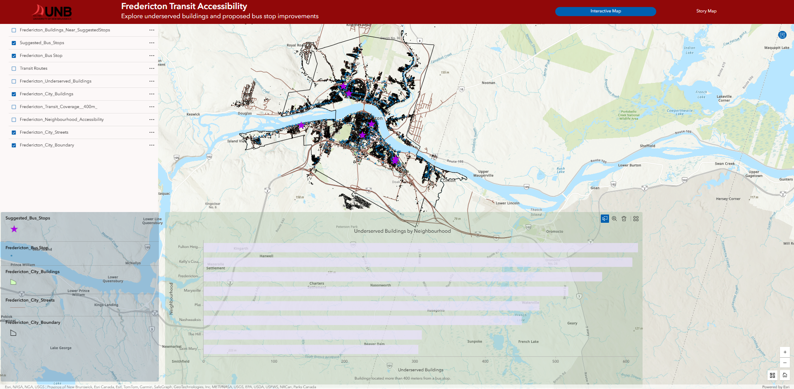
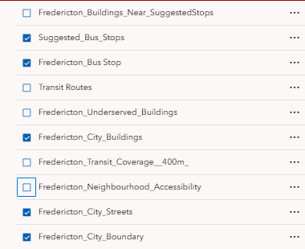
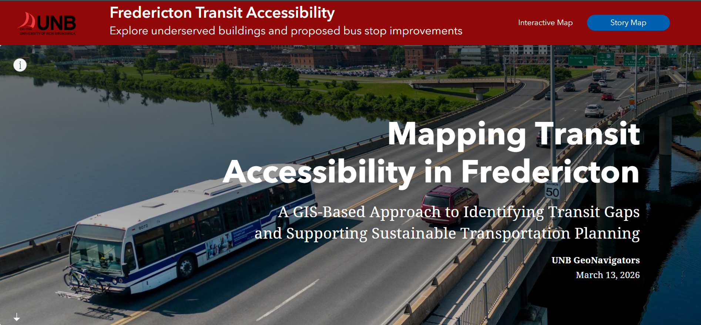
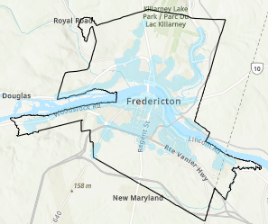
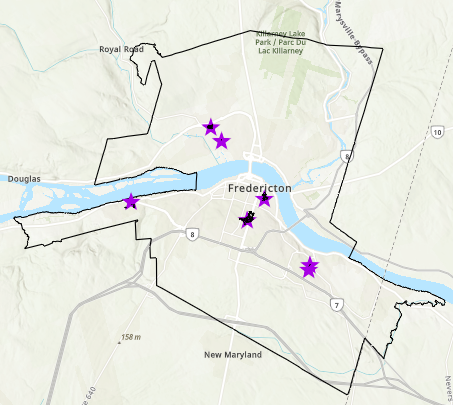

# Fredericton Transit Accessibility App

Desktop-Oriented Web GIS Application

## Team UNB GeoNavigators

- Somtochukwu Nwachukwu
- Muhammad Waleed

## Live App Links

- Interactive Experience Builder App: https://experience.arcgis.com/experience/fc4946c90d9a49cba45c21b4bd142761/page/Interactive-Map
- StoryMap: https://arcg.is/1WjXHy1
- Demo Video : [Video](https://www.youtube.com/watch?v=4xJh9Ueesz8)

## Quick Start

1. Open the interactive app and zoom to an area of interest.
2. Turn on **Fredericton_Transit_Coverage_400m** to view current walkable coverage.
3. Turn on **Fredericton_Underserved_Buildings** to find buildings outside coverage.
4. Switch on **Suggested_Bus_Stops** to explore proposed improvement locations.
5. Use the StoryMap to review data sources and methodology.

---

## Mission Statement

Public transportation plays an essential role in creating more sustainable, connected, and equitable cities. When residents live within a reasonable walking distance of transit stops, they are more likely to use public transportation instead of relying on private vehicles. This can help reduce traffic congestion, lower greenhouse gas emissions, and improve access to employment, education, and essential services. However, when buildings are located too far from bus stops, residents may face significant barriers to using public transit, especially those without access to a car.

The City of Fredericton, like many growing urban areas, contains neighborhoods where transit accessibility may be uneven. While some parts of the city are well served by bus stops and transit routes, other areas may have buildings located beyond a comfortable walking distance from transit service. Identifying these gaps is an important step toward improving transportation accessibility and supporting sustainable urban planning.

The mission of the Fredericton Transit Accessibility App is to use Geographic Information Systems (GIS) to identify gaps in transit accessibility across Fredericton and provide an interactive tool for exploring where improvements may be needed. By analyzing the spatial relationship between buildings, existing bus stops, and walking-distance service areas, the app highlights underserved buildings and explores potential locations where additional bus stops could improve access. Through interactive mapping and narrative storytelling, the application supports more informed, data-driven, and sustainable transportation planning.

---

## About Our App

The Fredericton Transit Accessibility App is a web-based GIS application that combines an **interactive map** with a **StoryMap narrative** to help users understand public transit accessibility across Fredericton, New Brunswick.

The app focuses on a simple but important planning question:

**How accessible are bus stops to buildings within the city, based on walking distance?**

To answer this, the project uses GIS analysis to:

- map existing bus stop locations
- create a 400-meter walking-distance buffer around transit stops
- identify buildings located outside the standard walking distance to transit
- examine which neighborhoods are most affected by limited transit access
- suggest possible locations where additional bus stops could improve coverage

The application was developed using **ArcGIS Pro**, **ArcGIS Online**, **ArcGIS Experience Builder**, and **ArcGIS StoryMaps**. The final product allows users to visually explore transit patterns, view underserved areas, and understand how GIS can support transportation planning decisions.

---

## Statement of Characteristics

The Fredericton Transit Accessibility App combines an interactive web map and a StoryMap to create an experience that is appealing, informative, and useful for end users. Some of the key characteristics of the app are:

### Interactive Map Display

The interactive map is the main feature of the application. It provides users with a clear visual display of Fredericton’s building footprints, existing bus stops, transit routes, underserved buildings, and suggested locations for new bus stops. Users can toggle layers on and off to explore different aspects of transit accessibility.

### Clear Identification of Transit Gaps

The application highlights buildings located beyond the standard **400-meter walking distance** from bus stops. This allows users to quickly identify where transit accessibility may be limited and where service gaps exist across the city.

### Proposed Bus Stop Improvements

The app includes suggested bus stop locations generated from GIS analysis. These points show where additional transit stops could potentially improve service coverage for nearby underserved buildings.

### StoryMap Narrative

In addition to the interactive map, the application includes a StoryMap that explains the purpose of the project, the datasets used, the GIS methodology, and the key findings. This helps users understand not just what the map shows, but also why the results matter.

### Planning and Decision Support

The application can support city planners, transportation agencies, researchers, students, and residents in understanding transit accessibility patterns and identifying areas where new bus stops or route changes may be beneficial.

### Accessible and Engaging Design

By combining interactive GIS visualization with a guided narrative format, the app transforms technical spatial analysis into a format that is easy to understand for both technical and non-technical audiences.

---

## User Guide

The Fredericton Transit Accessibility App contains two main components that work together to help users explore and understand transit accessibility across Fredericton:

1. **Interactive Transit Accessibility Map**
2. **Transit Accessibility StoryMap**

At the top of the application interface, users will find two navigation buttons labeled **Interactive Map** and **Story Map**. These buttons allow users to switch between the two parts of the application at any time.

The **Interactive Map** provides a hands-on GIS exploration environment where users can view transit infrastructure, toggle map layers, examine underserved buildings, and explore suggested bus stop locations.

The **Story Map** presents a guided narrative explaining the purpose of the project, the datasets used, the GIS analysis process, and the key findings.

Together, these two components allow users to both **interactively explore the spatial data** and **understand the analysis behind the results**, making the application informative for both technical and non-technical audiences.

---

## Interactive Map

The interactive map allows users to explore existing transit infrastructure and buildings across Fredericton.

### Main Map Layers

The map includes the following major layers:

  
<strong><h3>Map Layers (click to expand)</h3></strong>

- **Fredericton_Buildings_Near_SuggestedStops**  
  Displays buildings that fall within the service area of the proposed bus stop locations.

- **Suggested_Bus_Stops**  
  Displays proposed bus stop locations identified through spatial analysis.

- **Fredericton_Bus_Stop**  
  Displays the locations of existing bus stops in the city.

- **Transit Routes**  
  Shows existing transit route alignments across Fredericton.

- **Fredericton_Underserved_Buildings**  
  Highlights buildings located outside the 400-meter walking distance from bus stops.

- **Fredericton_City_Buildings**  
  Displays building footprints throughout Fredericton.

- **Fredericton_Transit_Coverage_400m**  
  Displays the 400-meter walking-distance service area around existing bus stops.

- **Fredericton_Neighbourhood_Accessibility**  
  Shows neighborhood-level patterns of transit accessibility.

- **Fredericton_City_Streets**  
  Displays the street network used as geographic reference for the map.

- **Fredericton_City_Boundary**  
 Shows the boundary of the City of Fredericton study area.

### How to Use the Interactive Map

#### Toggle Layers

Users can turn layers on and off in the layer list to focus on specific aspects of the analysis, such as existing bus stops, underserved buildings, or suggested improvements.

#### View Feature Information

Users can click on features such as bus stops or suggested bus stop locations to view detailed attribute information in the popup panel.

#### Explore Underserved Buildings

By enabling the underserved buildings layer, users can identify buildings that are located beyond walking distance from transit stops.

#### Compare Existing Stops and Suggested Stops

Users can compare current transit stop locations with suggested bus stop points to better understand where service improvements may be useful.

#### Neighborhood Accessibility

The map can also be used to examine how underserved buildings are distributed across different neighborhoods in Fredericton.

#### Underserved Buildings by Neighborhood

The application also includes a chart that summarizes the number of underserved buildings within each neighborhood in Fredericton.  
This visualization allows users to quickly identify which neighborhoods experience the greatest gaps in transit accessibility.

By comparing the number of buildings located beyond the 400-meter transit coverage area, users can better understand how transit access varies across the city and which communities may benefit most from additional bus stop infrastructure.

_Insight:_ The chart shows that underserved buildings are concentrated in a few neighborhoods, helping prioritize where new stops may have the greatest impact.

---

## StoryMap

The StoryMap provides a guided explanation of the project and walks users through the purpose, analysis steps, and major findings.

### StoryMap Sections

The StoryMap includes the following sections:

- **Introduction / Title Section**
- **Why Transit Accessibility Matters**
- **Project Objective**
- **Data Sources**
- **GIS Methodology**
- **Interactive Transit Accessibility Map**
- **Key Findings**
- **Sustainability Implications**
- **Conclusion**
- **Future Work**
- **Explore the App**

### Purpose of the StoryMap

The StoryMap helps users understand:

- why transit accessibility is important
- how the GIS analysis was carried out
- what the results show
- how the interactive map should be interpreted

This makes the project more informative and accessible to a wide audience.

---

## GIS Methodology

The spatial analysis for this project was conducted in ArcGIS Pro using several GIS tools and workflows.

### Step 1: Mapping Existing Bus Stops

Existing bus stop data for Fredericton was mapped to represent the current transit network.

### Step 2: Creating Walkable Transit Coverage

A **400-meter buffer** was created around bus stops to represent a standard walkable distance to transit. Buildings inside this buffer were considered to have reasonable access to transit. This is visualized as the 400 m coverage layer (blue buffer polygons).

### Step 3: Identifying Underserved Buildings

Building footprints were compared to the bus stop service areas to identify buildings located outside the 400-meter transit coverage zone.

### Step 4: Neighborhood-Level Analysis

Underserved buildings were summarized by neighborhood in order to identify which parts of Fredericton contain the greatest concentration of buildings with limited transit access.

### Step 5: Evaluating Potential Improvements

Gap areas outside existing transit coverage were converted into candidate bus stop locations using the **Feature To Point** tool in ArcGIS Pro (points placed at polygon centroids or within polygons).

---

## Project Methodology and Limitations

### Methodology

This project uses a distance-based accessibility approach. A 400-meter Euclidean buffer was selected as the primary benchmark for transit accessibility because it is commonly used in transit planning as a reasonable walking distance to a bus stop.

The analysis was conducted at the building level in order to provide a more detailed understanding of accessibility patterns than would be possible using only larger boundary units.

The final outputs include:

- bus stop service areas
- underserved buildings
- neighborhood-level summaries
- suggested bus stop locations

### Limitations

While the project provides useful insight into transit accessibility, several limitations should be acknowledged:

#### Euclidean Distance

The 400-meter service area is based on straight-line distance rather than actual walking routes along sidewalks or streets. A network-based walking analysis would provide a more realistic representation of pedestrian access.

#### Building Use

The building dataset includes all building footprints and may not distinguish perfectly between residential, commercial, industrial, or institutional uses. Future work could refine the analysis by focusing specifically on residential buildings.

#### Bus Stop Suitability

Suggested bus stop locations were generated from spatial gap analysis and do not account for all real-world planning constraints such as road safety, stop spacing policies, ridership demand, sidewalk access, or operational feasibility.

#### Transit Frequency and Service Quality

This project focuses on spatial accessibility to bus stops and does not include service frequency, schedule reliability, route timing, or passenger demand.

#### Building Dataset Currency

The building footprints dataset only reflects development data available up to April 2025. Buildings added or changed after that date, including newer developments by March 2026, are not included in the analysis. This may slightly reduce the accuracy of results in recently developed areas.

---

## Why the App Is Useful

The Fredericton Transit Accessibility App helps users:

- understand where current transit service is strong
- identify buildings and neighborhoods with limited access to bus stops
- explore where additional transit stops may improve service
- support conversations about transportation equity and sustainability
- visualize planning problems using clear and interactive GIS tools

The app is useful for:

- city planners
- transit agencies
- researchers
- students
- residents interested in local transportation planning

---

## Key Findings (Summary)

- Transit access gaps are spatially clustered: a small number of neighborhoods account for a large share of underserved buildings.
- Proposed bus stop points show where small infrastructure changes could improve coverage for nearby buildings.
- Neighborhood summaries allow quick prioritization for planning discussions.

## Data Sources

All datasets are from the City of Fredericton Open Data Portal and are subject to the Open Data License terms.

| Dataset                    | Type    | Source                                                                                                |
| -------------------------- | ------- | ----------------------------------------------------------------------------------------------------- |
| Building Footprints        | Polygon | https://data-fr-fredericton.opendata.arcgis.com/datasets/building-footprints-1                        |
| BusStops                   | Point   | https://data-fredericton.opendata.arcgis.com/datasets/busstops/about                                  |
| Transit Routes             | Line    | https://data-fredericton.opendata.arcgis.com/maps/39b304cf72674415ab9514cc2c36b92a                    |
| Neighbourhoods / Quartiers | Polygon | https://data-fredericton.opendata.arcgis.com/datasets/Fredericton%3A%3Aneighbourhoods-quartiers/about |
| Street CenterLines         | Line    | https://data-fredericton.opendata.arcgis.com/items/d3f6933108cc4c439314571e2078ac9d                   |
| City Boundary              | Polygon | https://data-fredericton.opendata.arcgis.com/datasets/Fredericton%3A%3Acity-boundary/about            |

Bus stop locations were inventoried/field-checked in 2017; subsequent changes may not be reflected.

### Data Source

City of Fredericton Open Data Portal:
https://www.fredericton.ca/about-fredericton/open-data-portal-0

Open Data License (City of Fredericton):
https://data-fredericton.opendata.arcgis.com/pages/open-data-license

Esri documentation:
ArcGIS Pro Buffer tool: https://pro.arcgis.com/en/pro-app/latest/tool-reference/analysis/buffer.htm
ArcGIS Online Summarize Within: https://doc.arcgis.com/en/arcgis-online/analyze/summarize-within-mv.htm
ArcGIS Pro Feature To Point: https://pro.arcgis.com/en/pro-app/3.4/tool-reference/data-management/feature-to-point.htm
ArcGIS StoryMaps overview: https://doc.esri.com/en/arcgis-storymaps/latest/get-started/what-is-arcgis-storymaps.html
Experience Builder Map Layers widget: https://doc.arcgis.com/en/experience-builder/latest/configure-widgets/map-layers-widget.htm

---

## Technologies Used

The application was developed using the following ESRI technologies:

- **ArcGIS Pro** – spatial analysis and map production
- **ArcGIS Online** – hosting layers and sharing web maps
- **ArcGIS Experience Builder** – interactive application development
- **ArcGIS StoryMaps** – narrative presentation of the project

## Code / Configuration

This project was built using ArcGIS Experience Builder and ArcGIS StoryMaps without custom source code. The ArcGIS Pro project zip can be found in the exports file of our repository.

---

## Future Improvements

Future versions of this project could be improved by including:

- population density data
- demographic data
- transit ridership statistics
- pedestrian network analysis

These additions would make the accessibility analysis more realistic and more useful for long-term planning.

---

**Team UNB GeoNavigators 2026**

Developed as part of a GIS analysis project exploring public transit accessibility and sustainable urban transport.

## AI Use Declaration

AI assistance (ChatGPT) was used to help draft portions of the README text and was edited manually by the team.
